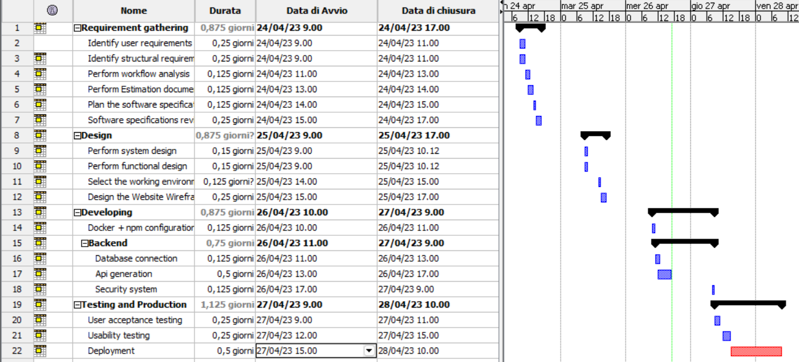

# Project Estimation - CURRENT
Date: 21/04/2023

Version: 1

# Estimation approach
# Estimate by size
### 
|             | Estimate                        |             
| ----------- | :-------------------------------: |  
| NC =  Estimated number of classes to be developed   |    13                   |             
|  A = Estimated average size per class, in LOC       |   16                   | 
| S = Estimated size of project, in LOC (= NC * A) |208  |
| E = Estimated effort, in person hours (here use productivity 10 LOC per person hour)  |       20.8 person hours                               |   
| C = Estimated cost, in euro (here use 1 person hour cost = 30 euro) | 624€ | 
| Estimated calendar time, in calendar weeks (Assume team of 4 people, 8 hours per day, 5 days per week ) |   0.13 weeks = < 1 weeks              |               

# Estimate by product decomposition
### 
|         component name    | Estimated effort (person hours)   |             
| ----------- | :-------------------------------: | 
|requirement document    |  10 |
| GUI prototype |   5|
|design document | 5|
|code | 20|
| unit tests | 5|
| api tests | 5|
| management documents  | 2|

# Estimate by activity decomposition
### 
|         Activity name    | Estimated effort (person hours)   |             
| ----------- | :-------------------------------: | 
| <ul> <li> Requirement Gathering: <ul> <li> Identify user requirements</li><li> Identify structural requirements</li><li>Perform workflow analysis</li><li>Perform Estimation documentation</li><li>Plan the software specifications</li><li>Software specifications review</li></ul></ul>| 15 |
|<ul> <li>Design</li><ul><li>Perform system design</li><li>Perform functional design</li><li>Select the working environment</li><li>Design the Website Wireframe sketch (GUI)</li></ul> </ul>| 15 |
| <ul><li>Developing</li><ul><li>Docker + npm configuration</li><li>Backend:</li><ul><li>Database connection</li> <li>Api generation</li><li>Security system</li></ul></ul> |25|
| <ul><li>Testing and production</li><ul><li>User acceptance testing</li><li>Usability testing</li><li>Deployment</li></ul> |15 |
###

# Summary
|             | Estimated effort                        |   Estimated duration |          
| ----------- | :-------------------------------: | :---------------:|
| estimate by size |20.8ph|<1 weeks
| estimate by product decomposition | 52ph| <1 weeks
| estimate by activity decomposition |70ph|1.2 weeks

The estimation by size is determined by counting the number of js functions in the web application as classes. This includes the files containing the application's functionalities, which outlines its structure.\
The lines of code (LOC) counted exclude comments and blank spaces in those aforementioned functions. It also excludes all the code used for testing the product, which reduces the overall estimated duration.

The estimation based on product decomposition is based on the evaluation of the ideas as well as the complexity of the application and the technology used. Notice how it is higher than the previous estimation due to the consideration of the aforementioned factors.

The estimated time based on activity decomposition is subject to multiple factors, including the team members' experience, their workload on other projects that might impede the overall timeline, team-building commitments, misleading project planning and brainstorming meetings. Consequently, the estimated activities may take more time than any previously discussed estimations.