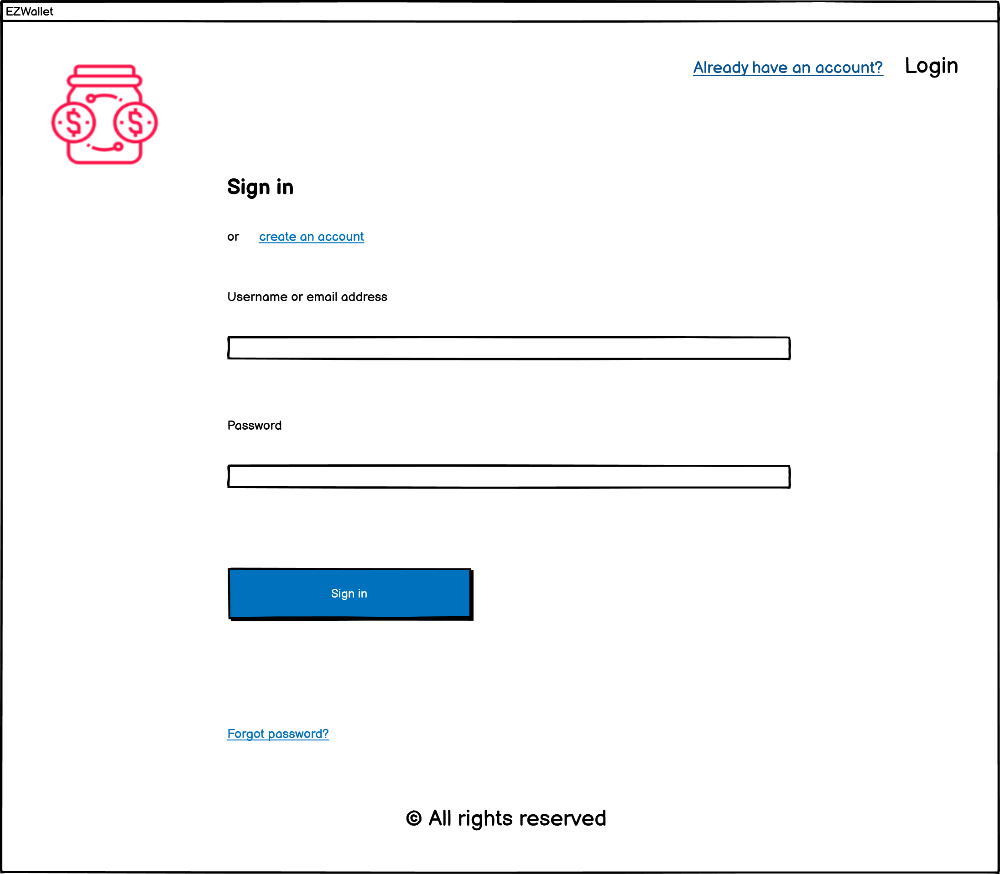
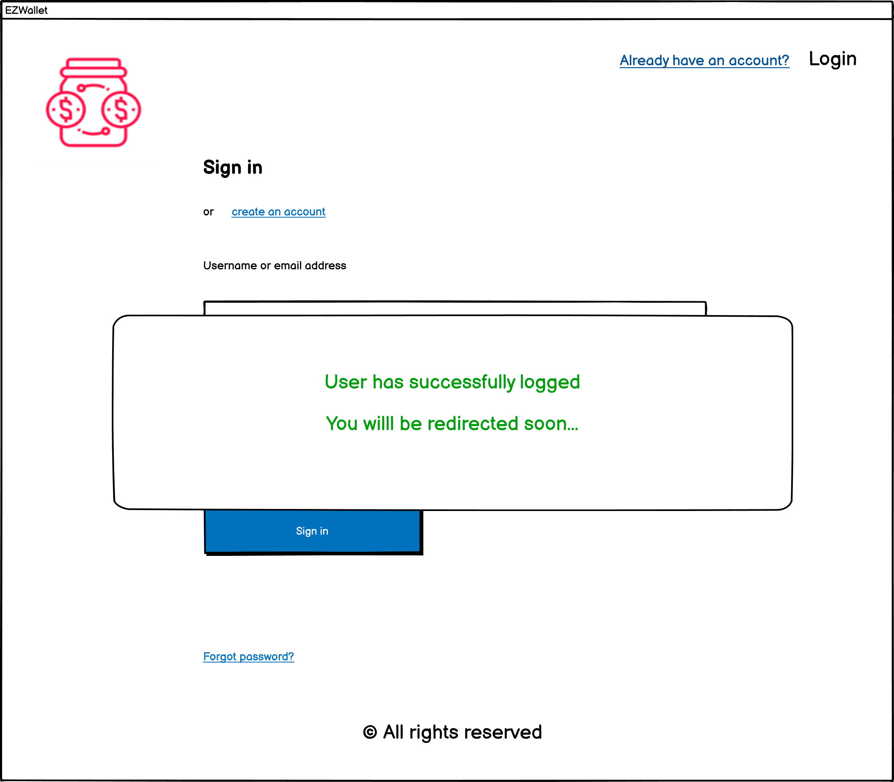
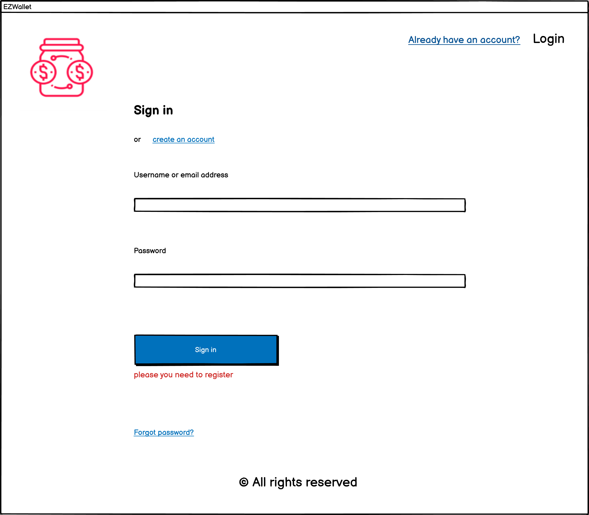
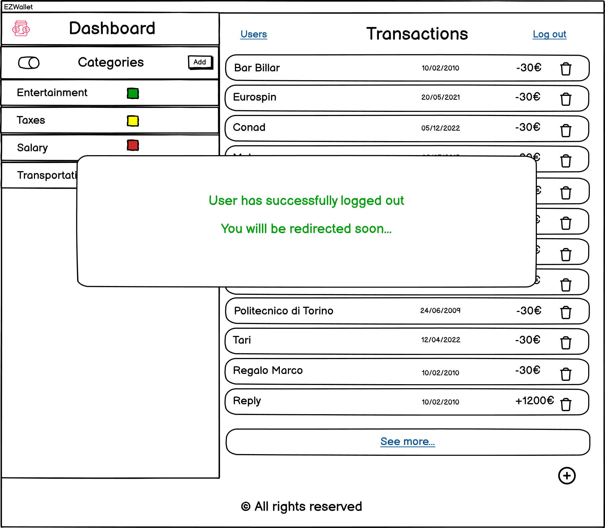
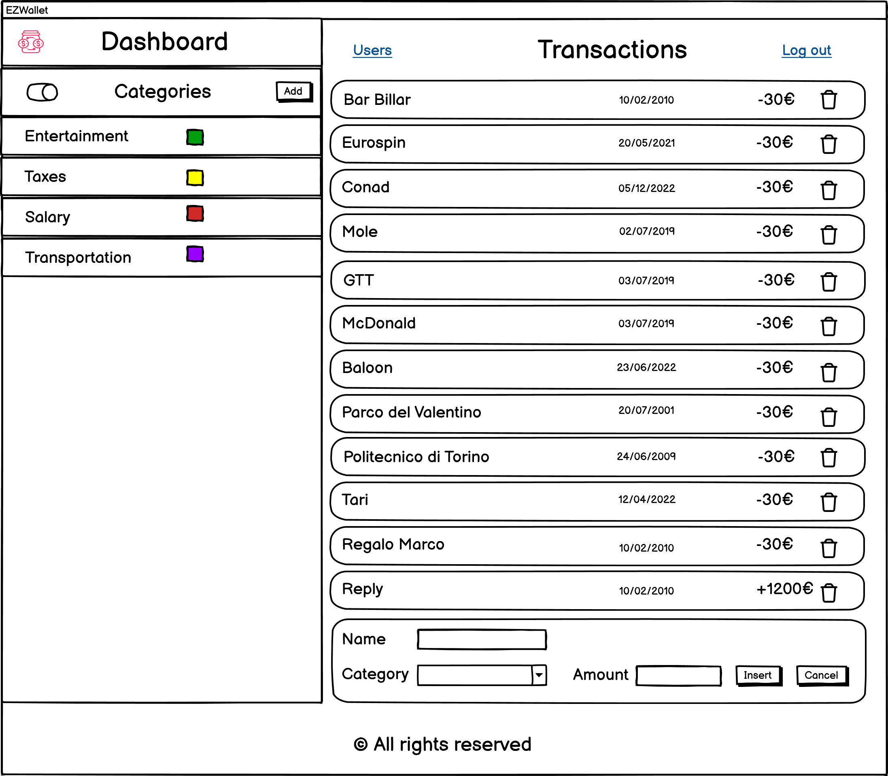
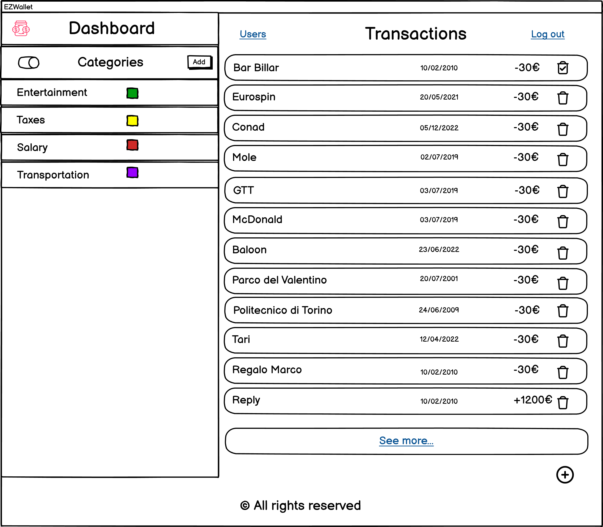
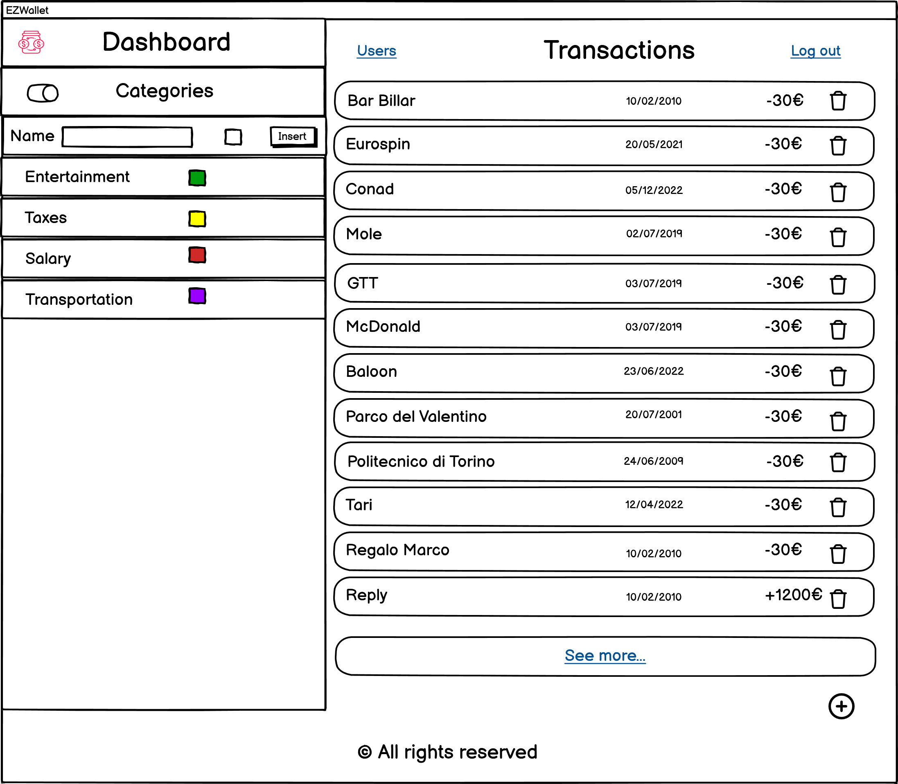

# Graphical User Interface Prototype  - CURRENT

Date: 28/04/2023

Version: V1
## Use case diagram
### Use case: Log in
##### Scenario 1 (Nominal Scenario)

##### Scenario 3 (Exception)

###### 3.1 Password is wrong

###### 3.2 Email doesn't exist

### Use case: Log out
##### Scenario 1 (Nominal Scenario)

### Use case: Sign up
##### Scenario 1 (Nominal Scenario)

##### Scenario 2 (Exceptions)

### Use case: Create Transaction
##### Scenario 1 (Nominal Scenario)

### Use case: Delete Transaction
##### Scenario 1 (Nominal Scenario)

### Use case: View Transactions / View Categories
##### Scenario 1 (Nominal Scenario)

##### Scenario 2 (Variant Labeled Transactions)

### Use case: Create Category
##### Scenario 1 (Nominal Scenario)

### Use case: View Accounts
##### Scenario 1 (Nominal Scenario)

##### Scenario 2 (Filter by username)
###### Scenario 2.1 Success

###### Scenario 2.2  Exception

