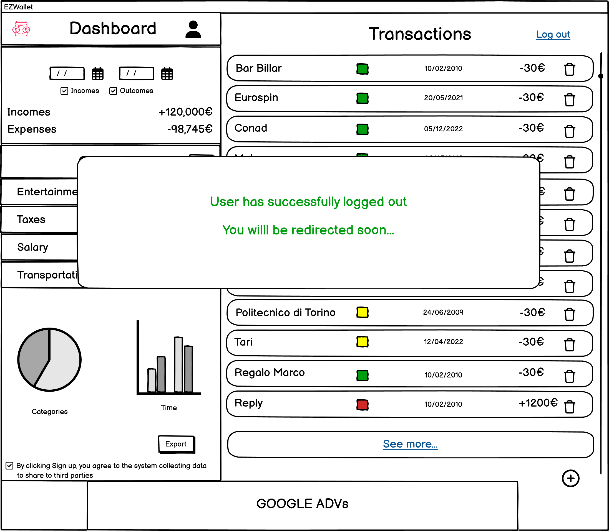
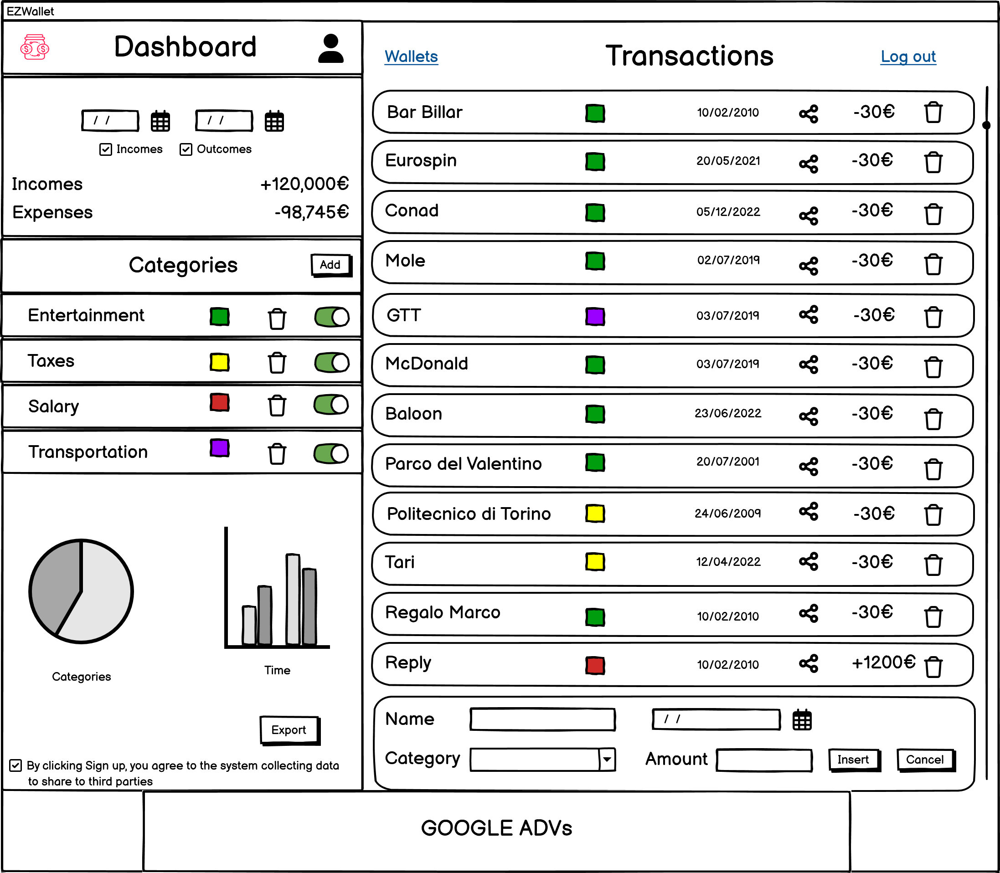
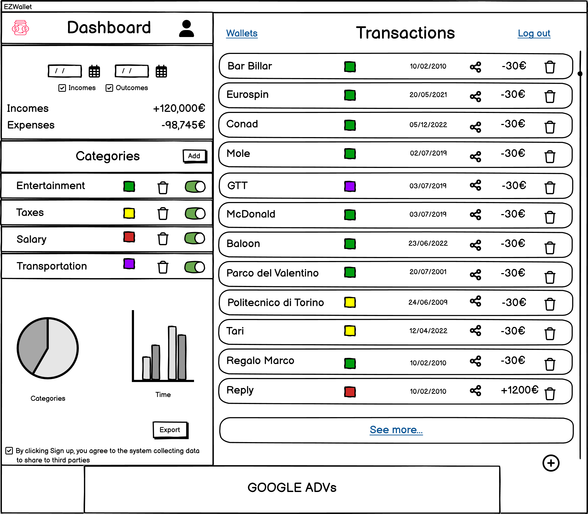
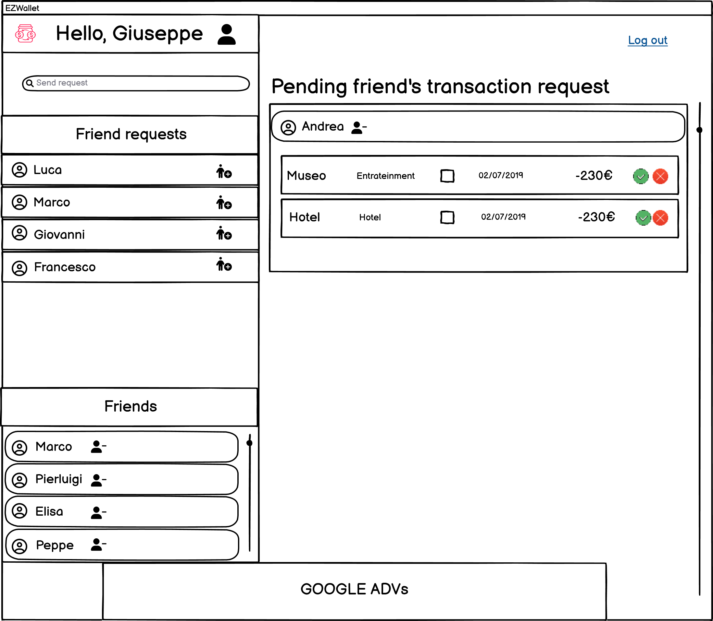

# Graphical User Interface Prototype  - CURRENT

Authors:

Date:

Version:
## Use case diagram
### Use case: Log In
##### Scenario 1 (Nominal Scenario)

##### Scenario 3 (Exception)
###### 3.1 Password is wrong

###### 3.2 Email doesn't exist

### Use case: Log out
##### Scenario 1 (Nominal Scenario)

### Use case: Sign up
##### Scenario 1 (Nominal Scenario)

##### Scenario 2 (Exceptions)

### Use case: Create Transaction
##### Scenario 1 (Nominal Scenario)

### Use case: Delete Transaction
##### Scenario 1 (Nominal Scenario)

### Use case: View Transactions / View Categories / Allow third party companies to use user's personal data / View Analytics / Export Analytics
##### Scenario 1 (Nominal Scenario)

##### Scenario 2 (Variant Transactions filtered by category)

##### Scenario 3 (Variant Transaction filtered by date)

### Use case Create Category
##### Scenario 1 (Nominal Scenario)

### Use case: View Accounts
##### Scenario 1 (Nominal Scenario)

##### Scenario 2 (Filter by username)
###### Scenario 2.1 Success

###### Scenario 2.2  Exception

### Use case Create Wallet
##### Scenario 1 (Nominal Scenario)

### Use case Delete Wallet
##### Scenario 1 (Nominal Scenario)

### Use case View Wallets / View Transactions inside a wallet / Use case Delete some transactions inside a wallet / Variant Transaction filtered by date
##### Scenario 1 (Nominal Scenario) / 

### Use case Insert some transactions inside a wallet
##### Scenario 1 (Nominal Scenario)

### Use case Send friend request / Respond friend request / View list of pending friend requests
##### Scenario 1 (Nominal Scenario)

##### Scenario 2 (Exceptions)

