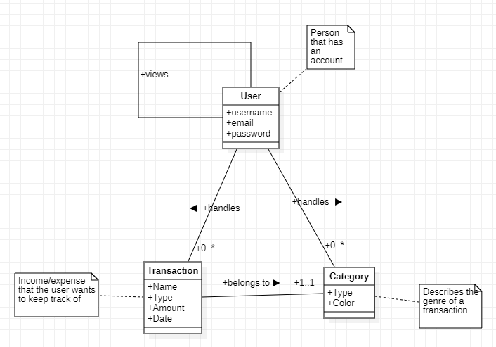
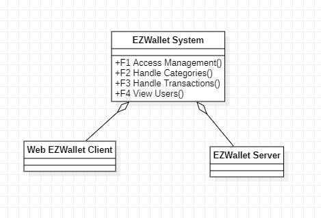
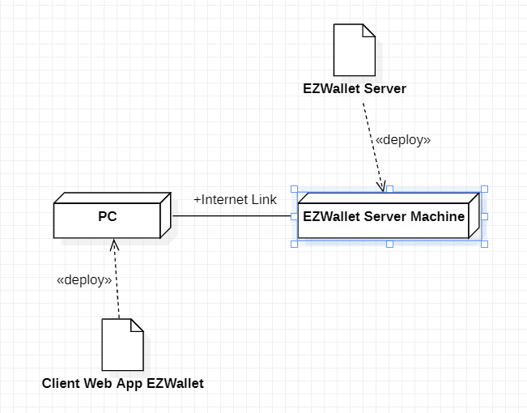

# Requirements Document - current EZWallet

Date: 22/04/2023

Version: V1 - description of EZWallet in CURRENT form (as received by teachers)

 
| Version number | Change |
| ----------------- |:-----------|
| v1 | Added following standard functionalities: <ul><li>Handle Categories transactions by category</li><li>Handle Transactions</li><li>View Users</li></ul>Added new roles:<ul><li>User</li></ul> | 

# Contents

- [Informal description](#informal-description)
- [Stakeholders](#stakeholders)
- [Context Diagram and interfaces](#context-diagram-and-interfaces)
	+ [Context Diagram](#context-diagram)
	+ [Interfaces](#interfaces) 
	
- [Stories and personas](#stories-and-personas)
- [Functional and non functional requirements](#functional-and-non-functional-requirements)
	+ [Functional Requirements](#functional-requirements)
	+ [Non functional requirements](#non-functional-requirements)
- [Use case diagram and use cases](#use-case-diagram-and-use-cases)
	+ [Use case diagram](#use-case-diagram)
	+ [Use cases](#use-cases)
    	+ [Relevant scenarios](#relevant-scenarios)
- [Glossary](#glossary)
- [System design](#system-design)
- [Deployment diagram](#deployment-diagram)

# Informal description
EZWallet (read EaSy Wallet) is a software application designed to help individuals and families keep track of their expenses. Users can enter and categorize their expenses, allowing them to quickly see where their money is going. EZWallet is a powerful tool for those looking to take control of their finances and make informed decisions about their spending.

# Stakeholders
| Stakeholder name  | Description | 
| ----------------- |:-----------:|
|   User     | The entity that uses the system         | 
|  Developers      | Programmers involved in the production of the system   |

# Context Diagram and interfaces

## Context Diagram

### Actor
- User

## Interfaces
| Actor | Logical Interface | Physical Interface  |
| ------------- |:-------------:| :-----:|
|  User    | GUI (handles transactions, categories and views users)  | PC |

# Stories and personas
| Persona       | Story  |
| ------------- |:-------------:|
|  average salary, female, married, with children, 45 yo     | Laura thinks she is not properly controlling her finance thus she needs to use EZWallet to get an overview and understand the reasons behind so many expenses. |
|  low salary, male, 27 yo     | Giuseppe wants to keep track of his expenses, he also would like to subdivide them into categories so that he can handle better his payments and look after the major incomes and outcomes of his EZwallet. |
|  student (no income), male, 22 yo     | Andrea lives in an apartment with two other guys, he sometimes gets the groceries for all his roomates but sometimes it's hard to remeber everything he spended for them. He would like to have an app that can track down for him the list of payments shared among the apartment.  |

# Functional and non functional requirements

## Functional Requirements
| ID        | Description  |
| ------------- |-------------|
|  <ul> <li> FR1 <ul> <li> FR1.1</li><li> FR1.2</li><li>FR1.3</li></ul> </ul> | <ul> <li> Access management : <ul> <li> Sign up</li><li> Log In</li><li>Log Out</li></ul> </ul> |
| <ul><li>FR2<ul><li>FR2.1</li><li>FR2.2</li></ul></ul> | <ul><li>Handle categories</li><ul><li>Create category</li><li>View list of categories</li></ul></ul> |
|  <ul><li>FR3<ul><li>FR3.1</li><li>FR3.2</li><li>FR3.3</li><li>FR3.4</li></ul></ul>   | <ul><li>Handle transactions</li><ul><li>Create transaction</li><li>Delete transaction</li><li>View list of transactions</li><li>Show list of labeled transactions </li></ul></ul> |
| <ul><li>FR4<ul><li>FR4.1</li><li>FR4.2</li></ul></ul> | <ul><li>View users</li><ul><li> View list of users' accounts</li><li> View info on a specific user</li></ul></ul> |

## Non Functional Requirements
| ID        | Type (efficiency, reliability, ..)           | Description  | Refers to |
| ------------- |:-------------:| -----|:-----:|
| NFR1 | Security | The system uses an hash function to encrypt the passwords inside the database | FR1.1 | 
|  <ul><li>NFR2<ul><li>NFR2.1</li><li>NFR2.2</ul></ul>    | Security | <ul><li>The system uses two tokens for the authorization to the app:</li><ul><li>Access token: expires in 1 hour</li><li>Refresh token: expires in 7 days</ul></ul>  | FR1.2 and FR1.3 |
| NFR3 | Usability | All functions can be used by users that have at least 6 months experience with a smartphones/tablets or PCs (on browser) | All FR | 

## Table of Access Rights
||User|
|-----|:------:|
|F1|yes|
|F2|yes|
|F3|yes|
|F4|yes|

# Use case diagram and use cases
## Use case diagram

### Use case Log In
| Actors Involved        | User |
| ------------- |:-------------:| 
|  Precondition     | The user has an account |
|  Post condition     | The user is authorized to log in |
|  Nominal Scenario     | The user wants to log in (without any token). He inserts the credentials, the credentials are correct |
|  Variants     | The user has already an access token and or a refresh token not yet expired. |
|  Exceptions     | 1) The user inserts a wrong password. 2) The email doesn't exist in the database. |

##### Scenario 1 (Nominal Scenario)
| Scenario 1.1 | Nominal Scenario |
| ------------- |:-------------:| 
|  Precondition     | The user has an account |
|  Post condition     | The user is authorized to use the app |
| Step#        | Description  |
|  1     | The system asks for the credentials |  
|  2     | The user inserts the credentials |
|  3	 | The system validates the credentials |
|  4	 | The system sends an access token and a refresh token |
|  5	 | The user's browser stores the token for further use |
|  6	 | The user is authorized|

##### Scenario 2 (User with token)
| Scenario 2.1 | User with token |
| ------------- |:-------------:| 
|  Precondition     | The user has an access token and/or a refresh token |
|  Post condition     | The user is authorized to use the app (he's automatically redirected to the home page) |
| Step#        | Description  |
|  1     | The system asks for the access token |  
|  2     | The user's browser gives the access token to the server or OR it requires a new access token with an api call by giving the refresh token to the server |
|  3	 | The user is authorized |

##### Scenario 3 (Exception)
| Scenario 3.1 | Password is wrong |
| ------------- |:-------------:| 
|  Precondition     | The password is wrong  |
|  Post condition     | The user is not authorized to use the app |
| Step#        | Description  |
|  1     | The system asks for the credentials |  
|  2     | The user inserts a wrong password |
|  3	 | The system sends back an error: "Wrong credentials" to the user |

| Scenario 3.2 | Email doesn't exist |
| ------------- |:-------------:| 
|  Precondition     | The email doesn't exist |
|  Post condition     | The user is not authorized to use the app |
| Step#        | Description  |
|  1     | The system asks for the credentials |  
|  2     | The user inserts a wrong email |
|  3	 | The system sends back an error: "Please you need to register" to the user |

### Use case Log Out
| Actors Involved        | User |
| ------------- |:-------------:| 
|  Precondition     | The user is logged in (he has referesh token) |
|  Post condition     | The user is logged out (the tokens are removed) |
|  Nominal Scenario     | The user wants to log out, it successfully log out  |
|  Variants     | - |
|  Exceptions     | - |

##### Scenario 1 (Nominal Scenario)
| Scenario 1.1 | Nominal Scenario |
| ------------- |:-------------:| 
|  Precondition     | The user is logged in (he has referesh token) |
|  Post condition     | The user is logged out (the tokens are removed) |
| Step#        | Description  |
|  1     | The user asks to log out |  
|  2     | The system seeks for the refresh token of the user who's making the request |
|  3	 | The system finds the entry of the user and removes it from the database |
|  4	 | The user has now completed the log out |

### Use case Sign up
| Actors Involved        | User |
| ------------- |:-------------:| 
|  Precondition     | The user hasn't an account |
|  Post condition     | The user has an account |
|  Nominal Scenario     | The user wants to create an account. The email is vaild. The user successfully creates an account|
|  Variants     | - |
|  Exceptions     | 1) The email is already used by another user |

##### Scenario 1 (Nominal Scenario)
| Scenario 1.1 | Nominal Scenario |
| ------------- |:-------------:| 
|  Precondition     | The user hasn't an account |
|  Post condition     | The user has an account |
| Step#        | Description  |
|  1     | The system asks to insert an email, an username and a password for the new account |  
|  2     | The user inserts the data requested by the system |
|  3	 | The system checks that the email is not used by any user yet |
|  4	 | The user has now an account |

##### Scenario 2 (Exceptions)
| Scenario 2.1 | Email already in use |
| ------------- |:-------------:| 
|  Precondition     | The email is already used by another user |
|  Post condition     | The account is not created for the user |
| Step#        | Description  |
|  1     | The system asks to insert an email, an username and a password for the new account | 
|  2     | The system checks that the email is not used by any user yet |
|  3	 | The system detects that the email is already in use |
|  4	 | The system returns an error: "you are already registered" to the user |
|  5	 | The account creation fails |

### Use case Create Transaction
| Actors Involved        | User |
| ------------- |:-------------:| 
|  Precondition     | The user has an account and he's logged in |
|  Post condition     | The transaction is created inside the user's account |
|  Nominal Scenario     | The user wants to create a transaction, the transaction is successfully created|
|  Variants     | - |
|  Exceptions     | - |

##### Scenario 1 (Nominal Scenario)
| Scenario 1.1 | Nominal Scenario |
| ------------- |:-------------:| 
|  Precondition     | The user has an account and he's logged in |
|  Post condition     | The transaction is created inside the user's account |
| Step#        | Description  |
|  1     | The user asks to create a transaction (giving: name, amount, type) |  
|  2     | The system inserts the new transaction inside the database |
|  3	 | The transaction is created and the user can now see it inside the app |

### Use case Delete Transaction
| Actors Involved        | User |
| ------------- |:-------------:| 
|  Precondition     | The user has a transaction inside his account |
|  Post condition     | The transaction is deleted |
|  Nominal Scenario     | The user wants to delete a transaction, the transaction is deleted |
|  Variants     | - |
|  Exceptions     | - |

##### Scenario 1 (Nominal Scenario)
| Scenario 1.1 | Nominal Scenario |
| ------------- |:-------------:| 
|  Precondition     | The user has a transaction inside his account |
|  Post condition     | The transaction is deleted |
| Step#        | Description  |
|  1     | The user asks to delete a transaction |  
|  2     | The system deletes the transaction from the database |
|  3	 | The transaction is deleted and the user cannot see it anymore in the app |

### Use case View Transactions
| Actors Involved        | User |
| ------------- |:-------------:| 
|  Precondition     | The user has an account and he's logged in |
|  Post condition     | All the transactions are shown to the user |
|  Nominal Scenario     | The user wants to view all his transactions, all the transactions are shown |
|  Variants     |  All the transactions with their respective category (type and color) are shown to the user |
|  Exceptions     | - |

##### Scenario 1 (Nominal Scenario)
| Scenario 1.1 | Nominal Scenario |
| ------------- |:-------------:| 
|  Precondition     | The user has an account and he's logged in |
|  Post condition     | All the transactions are shown to the user |
| Step#        | Description  |
|  1     | The user asks to view all his transactions |  
|  2     | The system retreives all the transactions of the user from the database |
|  3	 | The list of transactions is sent to the user |

##### Scenario 2 (Variant Labeled Transactions)
| Scenario 2.1 | Labeled Transactions |
| ------------- |:-------------:| 
|  Precondition     | The user has an account and he's logged in |
|  Post condition     | All the transactions with their respective category (type and color) are shown to the user |
| Step#        | Description  |
|  1     | The user asks to view all his transactions along with the details regarding their category type and color |  
|  2     | The system retreives all the transactions and the categories from the database |
|  3	 | The list of transactions joined with the respective categories description is sent to the user |

### Use case Create Category
| Actors Involved        | User |
| ------------- |:-------------:| 
|  Precondition     | The user has an account and he's logged in |
|  Post condition     | The new category is created |
|  Nominal Scenario     | The user wants to create a category, the category is created|
|  Variants     | - |
|  Exceptions     | - |

##### Scenario 1 (Nominal Scenario)
| Scenario 1.1 | Nominal Scenario |
| ------------- |:-------------:| 
|  Precondition     | The user has an account and he's logged in |
|  Post condition     | The new category is created |
|  1     | The user asks to create a category (giving: type, color) |  
|  2     | The system creates a new category |
|  3	 | The category is now available to the user |

### Use case View Categories
| Actors Involved        | User |
| ------------- |:-------------:| 
|  Precondition     | The user has an account and he's logged in |
|  Post condition     | All the categories are shown to the user |
|  Nominal Scenario     | The user wants to view all his categories, all the categories are shown |
|  Variants     | - |
|  Exceptions     | - |

##### Scenario 1 (Nominal Scenario)
| Scenario 1.1 | Nominal Scenario |
| ------------- |:-------------:| 
|  Precondition     | The user has an account and he's logged in |
|  Post condition     | All the categories are shown to the user |
| Step#        | Description  |
|  1     | The user asks to view all his categories |  
|  2     | The system retreives all the categories of the user from the database |
|  3	 | The list of categories is sent to the user |

### Use case View Accounts
| Actors Involved        | User |
| ------------- |:-------------:| 
|  Precondition     | The user has an account and he's logged in  |
|  Post condition     | All the users are shown |
|  Nominal Scenario     | The user wants to view all users inside the database, all the users are shown |
|  Variants     | The user wants to search for a specific user |
|  Exceptions     | 1) When filtering by username the username and the refresh token don't match |

##### Scenario 1 (Nominal Scenario)
| Scenario 1.1 | Nominal Scenario |
| ------------- |:-------------:| 
|  Precondition     | The user has an account and he's logged in  |
|  Post condition     | All the users are shown |
| Step#        | Description  |
|  1     | The user asks to search all users|  
|  2     | The system retreives all users inside the database |
|  3	 | The list of users is sent back |

##### Scenario 2 (Filter by username)
| Scenario 2.1 | Filter by username - success |
| ------------- |:-------------:| 
|  Precondition     | The user has an account and he's logged in  |
|  Post condition     | The specific user is shown |
| Step#        | Description  |
|  1     | The user asks information about a specific user |  
|  2     | The system retreives the user inside the database |
|  3	 | The user's data is sent back |

| Scenario 2.2 | Filter by username - exception |
| ------------- |:-------------:| 
|  Precondition     | The user has an account and he's logged in  |
|  Post condition     | The specific user is not shown |
| Step#        | Description  |
|  1     | The user asks information about a specific user |  
|  2     | The given username and refresh token don't match |
|  3	 | The system sends to the user an error |

# Glossary

# System Design

# Deployment Diagram 

# Defect Table
| Defect | Description |
|:------:|:-----------:|
| Admin missing | Some functionalities (i.e. FR4-View Users should be reserved to an administrator and it should be forbidden to the users) |
| Date field not properly used | When inserting a transaction the user should be able to set a chosen date (he is not able now) | 

