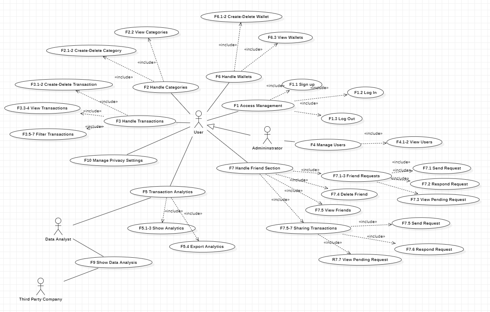
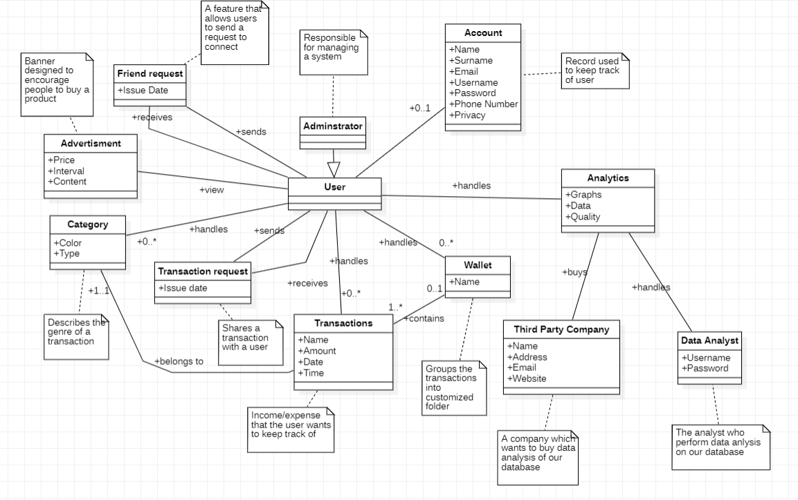
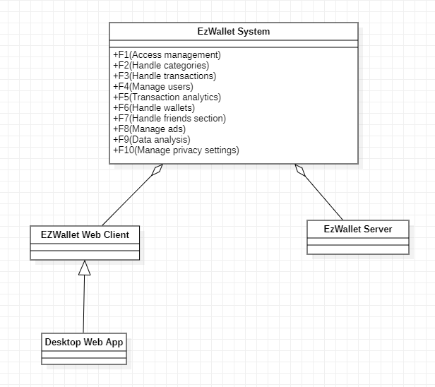
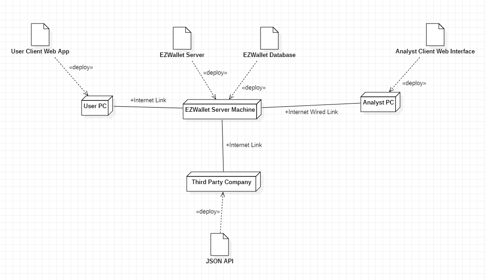

# Requirements Document - future EZWallet

Date: 23/04/2023

Version: V2 - description of EZWallet in FUTURE form (as proposed by the team)

 
| Version number | Change |
| ----------------- |:-----------|
| v2 | Added following standard functionalities: <ul><li>Filter transactions by category</li><li>Filter transactions by time window</li><li>Filter transactions by wallet</li><li>Category-wise pie chart</li><li>Time-wise Histogram</li><li>Visualization of total incomes/outcomes</li><li>Export into excel</li><li>Creation of wallets (folders)</li><li>Add friends</li><li>Share a transaction with a friend</li><li>Visualization of ads</li><li>Privacy and security settings</li></ul>Added analyst functionalities: <ul><li>Average income and outcome per year/month/week/day</li><li>Average income and outcome per similar categories</li><li>Rank of years/months/week with most money flow</li><li>Total number of users</li><li>Total number of transactions per category</li></ul>Added non functional requirements: <ul><li>Reliability</li><li>Efficiency</li><li>Portability</li></ul>Added new actors:<ul><li>Administrator</li><li>Data analyst</li><li>Third party company</li><li>Google Ads</li></ul>  | 

# Contents

- [Informal description](#informal-description)
- [Stakeholders](#stakeholders)
- [Context Diagram and interfaces](#context-diagram-and-interfaces)
	+ [Context Diagram](#context-diagram)
	+ [Interfaces](#interfaces) 
	
- [Stories and personas](#stories-and-personas)
- [Functional and non functional requirements](#functional-and-non-functional-requirements)
	+ [Functional Requirements](#functional-requirements)
	+ [Non functional requirements](#non-functional-requirements)
- [Use case diagram and use cases](#use-case-diagram-and-use-cases)
	+ [Use case diagram](#use-case-diagram)
	+ [Use cases](#use-cases)
    	+ [Relevant scenarios](#relevant-scenarios)
- [Glossary](#glossary)
- [System design](#system-design)
- [Deployment diagram](#deployment-diagram)

# Informal description
EZWallet (read EaSy Wallet) is a software application designed to help individuals and families keep track of their expenses. Users can enter and categorize their expenses, allowing them to quickly see where their money is going. EZWallet is a powerful tool for those looking to take control of their finances and make informed decisions about their spending.

# Stakeholders
| Stakeholder name  | Description | 
| ----------------- |:-----------:|
|   User     | The entity that uses the system         | 
| 	Administator       | Priviledged entity priorly created              |
|   Google Ads     |  System to visualize advertisement           |
|  Developer      | Programmer involved in the production of the system            |
|  Data Analyst      | Perform analytics on the data working on company           |
|  Third party company      | Buys data and analytics from system database            |

# Context Diagram and interfaces

## Context Diagram

### Actor
- User
- Admininstrator
- Google Ads
- Data Analyst
- Third party company

## Interfaces
| Actor | Logical Interface | Physical Interface  |
| ------------- |:-------------:| :-----:|
|  User    | GUI (handle transactions, categories. View simple analytics about his account)  | Smartphone/Tablet/PC |
|  Administrator   | GUI(handle users data with a privileged role)  | PC  |
|  Google Ads    | API:https://developers.google.com/google-ads/api/docs/start| Internet |
|  Data Analyst    | GUI(compute analytics on all the users data) | PC |
|  Third Party Company    | Retrive our data and analytics from system database (API:https://ezwallet.com/api/doc) | Internet |

# Stories and personas
| Persona       | Story  |
| ------------- |:-------------:|
|  average salary, female, married, with children, 45 yo     | Laura thinks she is not properly controlling her finance thus she needs to use EZWallet to get an overview and understand the reasons behind so many expenses. |
|  low salary, male, 27 yo     | Giuseppe wants to keep track of his expenses, he also would like to subdivide them into categories so that he can handle better his payments and look after the major incomes and outcomes of his EZwallet. |
|  student (no income), male, 22 yo     | Andrea lives in an apartment with two other guys, he sometimes get the groceries for all his roomates but sometimes it's hard to remeber everything he spended for them. He would like to have an app that can track down for him the list of payments shared among the apartment.  |
| high salary, male, 35 yo | Marco just started a new job and is planning a trip for his future holidays thus want to manage his savings and understand whether invest or not.  |
| DoubleCredit Company, 20+ years in the field of Finance| DoubleCredit wants to understand the customer's needs by collecting user data and expenses tendencies. Using the exported excels it boots the analysis of the company driving the correct future decision expenses   |
| Pierluigi, 35 years, Analyst | He struggles retriving informations from the application to make predictions and current stats and needs a proper GUI to help his work.   |

# Functional and non functional requirements
## Functional Requirements
| ID        | Description  |
| ------------- |-------------|
|  <ul> <li> FR1: <ul> <li> FR1.1</li><li> FR1.2</li><li>FR1.3</li></ul> </ul> | <ul> <li> Access management : <ul> <li> Sign up</li><li> Log In</li><li>Log Out</li></ul> </ul> |
| <ul><li>FR2:<ul><li>FR2.1</li><li>FR2.2</li><li>FR2.3</li></ul></ul> | <ul><li>Handle categories</li><ul><li>Create category</li><li>Delete category</li><li>View list of categories</li></ul></ul> |
|  <ul><li>FR3:<ul><li>FR3.1</li><li>FR3.2</li><li>FR3.3</li><li>FR3.4</li><li>FR3.5</li><li>FR3.6</li><li>FR3.7</li></ul></ul>   | <ul><li>Handle transactions</li><ul><li>Create transaction</li><li>Delete transaction</li><li>View list of transactions</li><li>Show list of labeled transactions </li><li>Filter transaction by category</li><li>Filter transactions by time window</li><li>Filter transactions by wallet</li></ul></ul> |
| <ul><li>FR4:<ul><li>FR4.1</li><li>FR4.2</li></ul></ul> | <ul><li>Manage users</li><ul><li> View list of users' accounts</li><li> View info on a specific user</li></ul></ul> |
| <ul><li>FR5:<ul><li>FR5.1</li><li>FR5.2</li><li>FR5.3</li><li>FR5.4</li></ul></ul> | <ul><li>Transaction analytics</li><ul><li>Show total amount of income/outcome</li><li>Pie chart of transaction divided by category</li><li>Hystogram of transactions divided by time windows</li><li>Export analytics in excel</li></ul></ul> |
| <ul><li>FR6:<ul><li>FR6.1</li><li>FR6.2</li><li>FR6.3</li></ul></ul> | <ul><li>Handle wallets</li><ul><li>Create wallet</li><li>Delete wallet</li><li>Show list of wallets</li></ul></ul> |
| <ul><li>FR7:<ul><li>FR7.1</li><li>FR7.2</li><li>FR7.3</li><li>FR7.4</li><li>FR7.5</li><li>FR7.5</li><li>FR7.6</li><li>FR7.7</li></ul></ul> | <ul><li>Handle friends section</li><ul><li>Send a friend request</li><li>Respond to a friend request</li><li>Show list of friend requests pending</li><li>Delete friend</li><li>Show list of friends</li><li>Send a share transaction request to a friend</li><li>Responde to share a transaction with a friend</li><li>Show list of share transaction requests pending</li></ul></ul> |
| <ul><li>FR8:<ul><li>FR8.1</li><li>FR8.2</li></ul></ul> | <ul><li>Manage ads</li><ul><li>Receive ad</li><li>Show ad</li></ul></ul> |
| <ul><li>FR9:<ul><li>FR9.1</li><li>FR9.2</li><li>FR9.3</li><li>FR9.4</li><li>FR9.5</li></ul></ul> | <ul><li>Data analysis</li><ul><li>Show average income and outcome per year/month/week/day</li><li>Show average income and outcome per similar categories</li><li>Show rank of years/months/week with most money flow</li><li>Show total number of users</li><li>Show total number of transactions per categories</li></ul> |
| <ul><li>FR10:<ul><li>FR10.1</li><li>FR10.2</li></ul></ul> | <ul><li>Manage privacy settings</li><ul><li>Allow third party companies to use user's personal data</li><li>Deny third party companies to use user's personal data </li></ul></ul> |

## Non Functional Requirements
| ID        | Type (efficiency, reliability, ..)           | Description  | Refers to |
| ------------- |:-------------:| :-----:| -----:|
| NFR1 | Security | The system uses an hash function to encrypt the passwords inside the database | FR1.1 | 
|  <ul><li>NFR2:<ul><li>NFR2.1</li><li>NFR2.2</ul></ul>    | Security | <ul><li>The system uses two tokens for the authorization to the app:</li><ul><li>Access token: expires in 1 hour</li><li>Refresh token: expires in 7 days</ul>  | FR1.2 and FR1.3 |
|  <ul><li>NFR3:<ul><li>NFR3.1</li><li>NFR3.2</li><li>NFR3.3</li><li>NFR3.4</li><li>NFR3.5</li></ul></ul>     | Portability | <ul><li>Support on the major browsers: </li><ul><li>Support from Chrome v108.0</li><li>Support from Firefox v100.3</li><li>Support from Safari v15.6.1</li><li>Support from Opera v8</li><li>Support from Edge v107.0 </li></ul> | All FR |
|  NFR4     | Portability | The application will guarantee the correct functioning on these screen sizes: 1366×768	(22.6%), 1920×1080	(20.87%) | All FR |
| NFR5 | Usability | All functions can be used by users that have at least 6 months experience with a smartphones/tablets or PCs (on browser) | All FR | 
| NFR6 | Mantainability | The maintenence of all the functional requirements should not take more than 1 week per functionality  | All FR | 
| NFR7 | Reliability | The failure rate should be under 1 failure per hundred hours | All FR | 
| NFR8 | Efficiency | All functionalities should take less than 0.5 sec, given the full correct functioning of the servers | All FR | 

## Table of Access Rights
||User|Administrator|Data analyst|Ads|
|-----|:------:|:------:|:------:|:------:|
|F1|yes|yes|||
|F2|yes|yes|||
|F3|yes|yes|||
|F4||yes|||
|F5|yes|yes|||
|F6|yes|yes|||
|F7|yes|yes|||
|F8||||yes|
|F9|||yes||
|F10|yes|yes|||

# Use case diagram and use cases

## Use case diagram

### Use case Log In
| Actors Involved        | User |
| ------------- |:-------------:| 
|  Precondition     | The user has an account |
|  Post condition     | The user is authorized to log in |
|  Nominal Scenario     | The user wants to log in (without any token). He inserts the credentials, the credentials are correct |
|  Variants     | The user has already an access token and or a refresh token not yet expired. |
|  Exceptions     | 1) The user inserts a wrong password. 2) The email doesn't exist in the database. |

##### Scenario 1 (Nominal Scenario)
| Scenario 1.1 | Nominal Scenario |
| ------------- |:-------------:| 
|  Precondition     | The user has an account |
|  Post condition     | The user is authorized to use the app |
| Step#        | Description  |
|  1     | The system asks for the credentials |  
|  2     | The user inserts the credentials |
|  3	 | The system validates the credentials |
|  4	 | The system sends an access token and a refresh token |
|  5	 | The user's browser stores the token for further use |
|  6	 | The user is authorized|

##### Scenario 2 (User with token)
| Scenario 2.1 | User with token |
| ------------- |:-------------:| 
|  Precondition     | The user has an access token and/or a refresh token |
|  Post condition     | The user is authorized to use the app (he's automatically redirected to the home page) |
| Step#        | Description  |
|  1     | The system asks for the access token |  
|  2     | The user's browser gives the access token to the server or OR it requires a new access token with an api call by giving the refresh token to the server |
|  3	 | The user is authorized |

##### Scenario 3 (Exception)
| Scenario 3.1 | Password is wrong |
| ------------- |:-------------:| 
|  Precondition     | The password is wrong  |
|  Post condition     | The user is not authorized to use the app |
| Step#        | Description  |
|  1     | The system asks for the credentials |  
|  2     | The user inserts a wrong password |
|  3	 | The system sends back to the user an error: "Wrong credentials" |

| Scenario 3.2 | Email doesn't exist |
| ------------- |:-------------:| 
|  Precondition     | The email doesn't exist |
|  Post condition     | The user is not authorized to use the app |
| Step#        | Description  |
|  1     | The system asks for the credentials |  
|  2     | The user inserts a wrong email |
|  3	 | The system sends back an error: "Please you need to register" to the user |

### Use case Log Out
| Actors Involved        | User |
| ------------- |:-------------:| 
|  Precondition     | The user is logged in (he has referesh token) |
|  Post condition     | The user is logged out (the tokens are removed) |
|  Nominal Scenario     | The user wants to log out, it successfully log out  |
|  Variants     | - |
|  Exceptions     | - |

##### Scenario 1 (Nominal Scenario)
| Scenario 1.1 | Nominal Scenario |
| ------------- |:-------------:| 
|  Precondition     | The user is logged in (he has referesh token) |
|  Post condition     | The user is logged out (the tokens are removed) |
| Step#        | Description  |
|  1     | The user asks to log out |  
|  2     | The system seeks for the refresh token of the user who's making the request |
|  3	 | The system finds the entry of the user and removes it from the database |
|  4	 | The user has now completed the log out |

### Use case Sign up
| Actors Involved        | User |
| ------------- |:-------------:| 
|  Precondition     | The user hasn't an account |
|  Post condition     | The user has an account |
|  Nominal Scenario     | The user wants to create an account. The email is vaild. The user chooses to allow sharing personal data to third party companies |
|  Variants     | 1) The user denies sharing data to third party companies |
|  Exceptions     | 1) The email is already used by another user |

##### Scenario 1 (Nominal Scenario)
| Scenario 1.1 | Nominal Scenario |
| ------------- |:-------------:| 
|  Precondition     | The user hasn't an account |
|  Post condition     | The user has an account |
| Step#        | Description  |
|  1     | The system asks to inserts email, username, name, surname, phone number and a password for the new account |  
|  2     | The user inserts the data requested by the system and leave the option of "allow sharing personal data to third party companies" to true |
|  3	 | The system checks that the email is not used by any user yet |
|  4	 | The user has now an account that shares data with thirds|

##### Scenario 2 (Variant Deny Third Party Companies)
| Scenario 2.1 | Variant Deny Third Party Companies |
| ------------- |:-------------:| 
|  Precondition     | The user hasn't an account |
|  Post condition     | The user has an account |
| Step#        | Description  |
|  1     | The system asks to inserts email, username, name, surname, phone number and a password for the new account |  
|  2     | The user inserts the data requested by the system and leave the option of "allow sharing personal data to third party companies" to true |
|  3	 | The system checks that the email is not used by any user yet |
|  4	 | The user has now an account that doesn't share data with thirds |

##### Scenario 3 (Exceptions)
| Scenario 3.1 | Email already in use |
| ------------- |:-------------:| 
|  Precondition     | The email is already used by another user |
|  Post condition     | The account is not created for the user |
| Step#        | Description  |
|  1     | The system asks to inserts an email, username, name, surname, phone number and a password for the new account | 
|  2     | The system checks that the email is not used by any user yet |
|  3	 | The system detects that the email is already in use |
|  4	 | The system returns an error: "you are already registered" to the user |
|  5	 | The account creation fails |
### Use case Create Transaction
| Actors Involved        | User |
| ------------- |:-------------:| 
|  Precondition     | The user has an account and he's logged in |
|  Post condition     | The transaction is created into the user's account |
|  Nominal Scenario     | The user wants to create a transaction, the transaction is successfully created|
|  Variants     | - |
|  Exceptions     | - |

##### Scenario 1 (Nominal Scenario)
| Scenario 1.1 | Nominal Scenario |
| ------------- |:-------------:| 
|  Precondition     | The user has an account and he's logged in |
|  Post condition     | The transaction is created into the user's account |
| Step#        | Description  |
|  1     | The user asks to create a transaction (giving: name, amount, type, date) |  
|  2     | The system inserts the new transaction inside the database |
|  3	 | The transaction is created and the user can now see it inside the app |
##### Scenario 2 (Variant Wallet)
| Scenario 2.1 | Nominal Scenario |
| ------------- |:-------------:| 
|  Precondition     | The user has an account and he's logged in |
|  Post condition     | The transaction is created into the user's account |
| Step#        | Description  |
|  1     | The user asks to create a transaction (giving: name, amount, type, date and wallet) |  
|  2     | The system inserts the new transaction inside the database |
|  3	 | The transaction is created and the user can now see it inside the app |

### Use case Delete Transaction
| Actors Involved        | User |
| ------------- |:-------------:| 
|  Precondition     | The user has a transaction inside his account |
|  Post condition     | The transaction is deleted |
|  Nominal Scenario     | The user wants to delete a transaction, the transaction is deleted |
|  Variants     | - |
|  Exceptions     | - |

##### Scenario 1 (Nominal Scenario)
| Scenario 1.1 | Nominal Scenario |
| ------------- |:-------------:| 
|  Precondition     | The user has a transaction inside his account |
|  Post condition     | The transaction is deleted |
| Step#        | Description  |
|  1     | The user asks to delete a transaction |  
|  2     | The system deletes the transaction from the database |
|  3	 | The transaction is deleted and the user cannot see it anymore in the app |

### Use case View Transactions
| Actors Involved        | User |
| ------------- |:-------------:| 
|  Precondition     | The user has an account and he's logged in |
|  Post condition     | All the transactions with their respective category (type and color) are shown to the user |
|  Nominal Scenario     | The user wants to view all his transactions with their respective category, all the transactions are shown |
|  Variants     |  1)The transactions are filtered with respect to the category. 2) The transactions are filtered with respect to the date. 3) The transactions are filtered by wallet |
|  Exceptions     | - |

##### Scenario 1 (Nominal Scenario)
| Scenario 1.1 | Labeled Transactions |
| ------------- |:-------------:| 
|  Precondition     | The user has an account and he's logged in |
|  Post condition     | All the transactions with their respective category (type and color) are shown to the user |
| Step#        | Description  |
|  1     | The user asks to view all his transactions along with the details regarding their category type and color |  
|  2     | The system retreives all the transactions and the categories from the database |
|  3	 | The list of transactions joined with the respective categories description is sent to the user |

##### Scenario 2 (Variant Transactions filtered by category)
| Scenario 2.1 | Nominal Scenario |
| ------------- |:-------------:| 
|  Precondition     | The user has an account and he's logged in |
|  Post condition     | All the transactions that match the categories selected by the user are shown |
| Step#        | Description  |
|  1     | The user asks to view all the transactions that corresponds only to certain categories |  
|  2     | The system retreives all the transactions that match the categories criteria chosen by the user  |
|  3	 | The list of transactions of the chosen categories is sent back |

##### Scenario 3 (Variant Transaction filtered by date)
| Scenario 3.1 | Nominal Scenario |
| ------------- |:-------------:| 
|  Precondition     | The user has an account and he's logged in |
|  Post condition     | All the transactions that match the selected time window by the user are shown |
| Step#        | Description  |
|  1     | The user asks to view all the transactions that corresponds only to a certain time window |  
|  2     | The system retreives all the transactions that match the time window criteria chosen by the user  |
|  3	 | The list of transactions of the chosen time window is sent back |

##### Scenario 4 (Variant Transaction filtered by wallet)
| Scenario 4.1 | Nominal Scenario |
| ------------- |:-------------:| 
|  Precondition     | The user has an account and he's logged in |
|  Post condition     | All the transactions that match the selected wallet by the user are shown |
| Step#        | Description  |
|  1     | The user asks to view all the transactions that corresponds only to a certain wallet |  
|  2     | The system retreives all the transactions that match the wallet criteria chosen by the user  |
|  3	 | The list of transactions of the chosen wallet is sent back |

### Use case Create Category
| Actors Involved        | User |
| ------------- |:-------------:| 
|  Precondition     | The user has an account and he's logged in |
|  Post condition     | The new category is created |
|  Nominal Scenario     | The user wants to create a category, the category is created|
|  Variants     | - |
|  Exceptions     | - |

##### Scenario 1 (Nominal Scenario)
| Scenario 1.1 | Nominal Scenario |
| ------------- |:-------------:| 
|  Precondition     | The user has an account and he's logged in |
|  Post condition     | The new category is created |
|  1     | The user asks to create a category (giving: type, color) |  
|  2     | The system creates a new category |
|  3	 | The category is now available to the user |

### Use case View Categories
| Actors Involved        | User |
| ------------- |:-------------:| 
|  Precondition     | The user has an account and he's logged in |
|  Post condition     | All the categories are shown to the user |
|  Nominal Scenario     | The user wanst to view all his categories, all the categories are shown |
|  Variants     | - |
|  Exceptions     | - |

##### Scenario 1 (Nominal Scenario)
| Scenario 1.1 | Nominal Scenario |
| ------------- |:-------------:| 
|  Precondition     | The user has an account and he's logged in |
|  Post condition     | All the categories are shown to the user |
| Step#        | Description  |
|  1     | The user asks to view all his categories |  
|  2     | The system retreives all the categories of the user from the database |
|  3	 | The list of categories is sent to the user |

### Use case Delete Category
| Actors Involved        | User |
| ------------- |:-------------:| 
|  Precondition     | The user has a category inside his account |
|  Post condition     | The category is deleted |
|  Nominal Scenario     | The user wants to delete a category that doesn't contain any transaction, the category is deleted |
|  Variants     | - |
|  Exceptions     | Some transactions still belong to the category that has to be deleted |

##### Scenario 1 (Nominal Scenario)
| Scenario 1.1 | Nominal Scenario |
| ------------- |:-------------:| 
|  Precondition     | The user has a category inside his account, there're no transaction of that category |
|  Post condition     | The category is deleted |
| Step#        | Description  |
|  1     | The user asks to delete a category |  
|  2     | The system deletes the category from the database |
|  3	 | The category is deleted and the user cannot see it anymore in the app |

##### Scenario 2 (Exceptions)
| Scenario 2.1 | Nominal Scenario |
| ------------- |:-------------:| 
|  Precondition     | The user has a category inside his account |
|  Post condition     | The category is not deleted |
| Step#        | Description  |
|  1     | The user asks to delete a category |  
|  2     | The system sees that there's still a transaction of that category |
|  3	 | The category is not deleted and the user receives an error |

### Use case View Accounts
| Actors Involved        | Administrator |
| ------------- |:-------------:| 
|  Precondition     | The aministrator has an account and he's logged in  |
|  Post condition     | All the users are shown |
|  Nominal Scenario     | The aministrator wants to view all users inside the database, all the users are shown |
|  Variants     | The aministrator wants to search for a specific user |
|  Exceptions     | 1) When filtering by username the username and the refresh token don't match |

##### Scenario 1 (Nominal Scenario)
| Scenario 1.1 | Nominal Scenario |
| ------------- |:-------------:| 
|  Precondition     | The aministrator has an account and he's logged in  |
|  Post condition     | All the users are shown |
| Step#        | Description  |
|  1     | The aministrator asks to search all users|  
|  2     | The system retreives all users inside the database |
|  3	 | The list of users is sent back |

##### Scenario 2 (Filter by username)
| Scenario 2.1 | Filter by username - success |
| ------------- |:-------------:| 
|  Precondition     | The aministrator has an account and he's logged in  |
|  Post condition     | The specific user is shown |
| Step#        | Description  |
|  1     | The aministrator asks information about a specific user |  
|  2     | The system retreives the user inside the database |
|  3	 | The user's data is sent back |

| Scenario 2.2 | Filter by username - exception |
| ------------- |:-------------:| 
|  Precondition     | The aministrator has an account and he's logged in  |
|  Post condition     | The specific user is not shown |
| Step#        | Description  |
|  1     | The aministrator asks information about a specific user |  
|  2     | The given username and refresh token don't match |
|  3	 | The system sends to the administrator an error |

### Use case View Analytics
| Actors Involved        | User |
| ------------- |:-------------:| 
|  Precondition     | The user has an account and he's logged in |
|  Post condition     | The analytics regarding the account are shown|
|  Nominal Scenario     | The user wants to view all his analytics, all the analytics are shown |
|  Variants     | - |
|  Exceptions     | - |

##### Scenario 1 (Nominal Scenario)
| Scenario 1.1 | Nominal Scenario |
| ------------- |:-------------:| 
|  Precondition     | The user has an account and he's logged in |
|  Post condition     | The analytics regarding the account are shown |
| Step#        | Description  |
|  1     | The user asks to view all his analytics |  
|  2     | The system retreives all the data to compute the analytics |
|  3	 | The system sends back the data  |
|  4	 | The GUI shows: 1.A pie chart divided by category, 2.An histogram based on time, 3.The total amount of income/outcome |

### Use case Export Analytics
| Actors Involved        | User |
| ------------- |:-------------:| 
|  Precondition     | The user has an account and he's logged in |
|  Post condition     | The analytics regarding the account are exported in an excel file |
|  Nominal Scenario     | The user wants to view his analytics inside an excel file, all the analytics are exported inside an excel file |
|  Variants     | - |
|  Exceptions     | - |

##### Scenario 1 (Nominal Scenario)
| Scenario 1.1 | Nominal Scenario |
| ------------- |:-------------:| 
|  Precondition     | The user has an account and he's logged in |
|  Post condition     | The analytics regarding the account are exported in an excel file |
| Step#        | Description  |
|  1     | The user asks the system to export all his analytics inside an excel file |  
|  2     | The system retreives all the data to compute the analytics |
|  3	 | The system stores the data inside an excel file  |
|  4	 | The file is sent back |

### Use case Create Wallet
| Actors Involved        | User |
| ------------- |:-------------:| 
|  Precondition     | The user has an account and he's logged in |
|  Post condition     | A new wallet is created |
|  Nominal Scenario     | The user wants to create a wallet, the wallet is created|
|  Variants     | - |
|  Exceptions     | - |

##### Scenario 1 (Nominal Scenario)
| Scenario 1.1 | Nominal Scenario |
| ------------- |:-------------:| 
|  Precondition     | The user has an account and he's logged in |
|  Post condition     | A new wallet is created |
|  1     | The user asks to create a wallet (giving a new name) |  
|  2     | The system creates a new wallet |
|  3	 | The wallet is now available to the user |

### Use case Delete Wallet
| Actors Involved        | User |
| ------------- |:-------------:| 
|  Precondition     | The user has a wallet inside his account |
|  Post condition     | The wallet is deleted |
|  Nominal Scenario     | The user wants to delete a wallet, the wallet is deleted |
|  Variants     | - |
|  Exceptions     | |

##### Scenario 1 (Nominal Scenario)
| Scenario 1.1 | Nominal Scenario |
| ------------- |:-------------:| 
|  Precondition     | The user has a wallet inside his account |
|  Post condition     | The wallet is deleted |
| Step#        | Description  |
|  1     | The user asks to delete a wallet |  
|  2     | The system deletes the wallet from the database |
|  3	 | The wallet is deleted and the user cannot see it anymore in the app |

### Use case View Wallets
| Actors Involved        | User |
| ------------- |:-------------:| 
|  Precondition     | The user has an account and he's logged in |
|  Post condition     | All the wallets are shown to the user |
|  Nominal Scenario     | The user wants to view all his wallets, all the wallets are shown |
|  Variants     | - |
|  Exceptions     | - |

##### Scenario 1 (Nominal Scenario)
| Scenario 1.1 | Nominal Scenario |
| ------------- |:-------------:| 
|  Precondition     | The user has an account and he's logged in |
|  Post condition     | All the wallets are shown to the user |
| Step#        | Description  |
|  1     | The user asks to view all his wallets |  
|  2     | The system retreives all the wallets of the user from the database |
|  3	 | The list of wallets is sent to the user |

### Use case Send friend request
| Actors Involved        | User |
| ------------- |:-------------:| 
|  Precondition     | The user has an account and he's logged in |
|  Post condition     | A friend request is sent to a specific user |
|  Nominal Scenario     | The user wants to send a friend request to another user, the friend request is succescully sent |
|  Variants     | - |
|  Exceptions     | 1)The username of the receiver doesn't exist |

##### Scenario 1 (Nominal Scenario)
| Scenario 1.1 | Nominal Scenario |
| ------------- |:-------------:| 
|  Precondition     | The user has an account and he's logged in, the receiver's username exist |
|  Post condition     | A friend request is sent to a specific user |
| Step#        | Description  |
|  1     | The user sends to the server the username of the user of which he wants to be friend with |  
|  2     | The system checks if the user exist, then he sends the friend request to that specific user  |
|  3	 | The friend request is sent |

##### Scenario 2 (Exceptions)
| Scenario 2.1 | The username of the reciever doesn't exist |
| ------------- |:-------------:| 
|  Precondition     | The user has an account and he's logged in |
|  Post condition     | The friend request is not sent to the specific user |
| Step#        | Description  |
|  1     | The user sends to the server the username of the user of which he wants to be friend with |  
|  2     | The system checks if the user exist, the user doesn't exist  |
|  3	 | The friend request is not sent and the sender of the friend request receive an error |

### Use case Respond friend request
| Actors Involved        | User |
| ------------- |:-------------:| 
|  Precondition     | The user has an account and he's logged in, there's a friend request pending |
|  Post condition     | A friend request from a specific user is accepted or refused |
|  Nominal Scenario     | The user wants to responde to a friend request from another user, the friend request is succescully accepted/refused |
|  Variants     | - |
|  Exceptions     | - |

##### Scenario 1 (Nominal Scenario)
| Scenario 1.1 | Nominal Scenario |
| ------------- |:-------------:| 
|  Precondition     | The user has an account and he's logged in, there's a friend request pending |
|  Post condition     | A friend request from a specific user is accepted or refused |
| Step#        | Description  |
|  1     | The user sends to the server the response to the corresponding friend request |  
|  2     | The system writes the result of the friend request inside the database  |
|  3	 | The friend request is responded |

### Use case View list of pending friend requests
| Actors Involved        | User |
| ------------- |:-------------:| 
|  Precondition     | The user has an account and he's logged in |
|  Post condition     | All the pending friend requests are shown to the user |
|  Nominal Scenario     | The user wants to view all his pending friend requests, all the pending friend requests are shown |
|  Variants     | - |
|  Exceptions     | - |

##### Scenario 1 (Nominal Scenario)
| Scenario 1.1 | Nominal Scenario |
| ------------- |:-------------:| 
|  Precondition     | The user has an account and he's logged in |
|  Post condition     | All the pending friend requests are shown to the user |
| Step#        | Description  |
|  1     | The user asks to view all his pending friend requests |  
|  2     | The systems retreives all the pending friend requests of the user from the database |
|  3	 | The list of pending friend requests is sent to the user |

### Use case Remove a friend
| Actors Involved        | User |
| ------------- |:-------------:| 
|  Precondition     | The user has an account and he's logged in, he as at least a friend |
|  Post condition     | The friend is removed from the list of friends |
|  Nominal Scenario     | The user wants to create remove a friend, the friend is removed from the list of friends|
|  Variants     | - |
|  Exceptions     | - |

##### Scenario 1 (Nominal Scenario)
| Scenario 1.1 | Nominal Scenario |
| ------------- |:-------------:|  
|  Precondition     | The user has an account and he's logged in, he as at least a friend |
|  Post condition     | The friend is removed from the list of friends |
| Step#        | Description  |
|  1     | The user sends to the server the username of the friend who he wants to remove from the friends list |  
|  2     | The system remove from the friends list of the user the username sent by the user |
|  3	 | The list of friends is up to date |

### Use case View list of friends
| Actors Involved        | User |
| ------------- |:-------------:| 
|  Precondition     | The user has an account and he's logged in |
|  Post condition     | All the friends are shown to the user |
|  Nominal Scenario     | The user want to view all his friends, all the friends are shown |
|  Variants     | - |
|  Exceptions     | - |

##### Scenario 1 (Nominal Scenario)
| Scenario 1.1 | Nominal Scenario |
| ------------- |:-------------:| 
|  Precondition     | The user has an account and he's logged in |
|  Post condition     | All the friends are shown to the user |
| Step#        | Description  |
|  1     | The user asks to view all his friends |  
|  2     | The system retreives all the friends of the user from the database |
|  3	 | The list of friends is sent to the user |

### Use case Send share transaction requeust to friends
| Actors Involved        | User |
| ------------- |:-------------:| 
|  Precondition     | The user is logged in, he has at least a friend and a transaction |
|  Post condition     | The share transaction request is sent to all friends that the user chose |
|  Nominal Scenario     | The user wants to share a transaction with a list of friends, on which the system will spil evenly the amount of the specific transaction |
|  Variants     | - |
|  Exceptions     | - |

##### Scenario 1 (Nominal Scenario)
| Scenario 1.1 | Nominal Scenario |
| ------------- |:-------------:| 
|  Precondition     | The user is logged in, he has at least a friend and a transaction |
|  Post condition     | The share transaction request is sent to all friends that the user chose |
| Step#        | Description  |
|  1     | The user sends to the server the transaction and the list of friends for which the user would like to share the transaction with |  
|  2     | The system sends share transaction requests to all the friends specified by the user |

### Use case Respond share transaction request
| Actors Involved        | User |
| ------------- |:-------------:| 
|  Precondition     | The user has an account and he's logged in, there's a share transaction request pending |
|  Post condition     | A share transaction request from a specific user is accepted or refused |
|  Nominal Scenario     | The user want to responde to a share transaction request from another user, the share transaction request is succescully accepted/refused |
|  Variants     | - |
|  Exceptions     | - |

##### Scenario 1 (Nominal Scenario)
| Scenario 1.1 | Nominal Scenario |
| ------------- |:-------------:| 
|  Precondition     | The user has an account and he's logged in, there's a share transaction request pending |
|  Post condition     | A share transaction request from a specific user is accepted or refused |
| Step#        | Description  |
|  1     | The user sends to the server the response to the corresponding share transaction request |  
|  2     | The system write the result of the share transaction request inside the database  |
|  3	 | The share transaction request is responded and the new amount that each person has to pay is updated |

### Use case View list of share transaction request pending
| Actors Involved        | User |
| ------------- |:-------------:| 
|  Precondition     | The user has an account and he's logged in |
|  Post condition     | All the share transaction pending requests are shown to the user |
|  Nominal Scenario     | The user want to view all his share transaction pending requests, all the share transaction pending requests are shown |
|  Variants     | - |
|  Exceptions     | - |

##### Scenario 1 (Nominal Scenario)
| Scenario 1.1 | Nominal Scenario |
| ------------- |:-------------:| 
|  Precondition     | The user has an account and he's logged in |
|  Post condition     | All the share transaction pending requests are shown to the user |
| Step#        | Description  |
|  1     | The user asks to view all his share transaction pending requests |  
|  2     | The system retreives all the share transaction pending requests of the user from the database |
|  3	 | The list of share transaction pending requests is sent to the user |

### Use case View data analysis
| Actors Involved        | Data Analyst |
| ------------- |:-------------:| 
|  Precondition     | - |
|  Post condition     | The data analysis regarding the all the users togheter are shown|
|  Nominal Scenario     | The data analyst wants to view all the data analysis regarfing all the users inside the database, the data anlysis is shown |
|  Variants     | - |
|  Exceptions     | - |

##### Scenario 1 (Nominal Scenario)
| Scenario 1.1 | Nominal Scenario |
| ------------- |:-------------:| 
|  Precondition     | - |
|  Post condition     | The data analysis regarding the all the users togheter are shown |
| Step#        | Description  |
|  1     | The data analyst asks to view the data analysis of all the users togheter |  
|  2     | The system retreives all the data to compute the data analysis |
|  3	 | The system sends back the data  |
|  4	 | The GUI shows: 1)Average income and outcome per year/month/week/day. 2)Average income and outcome per similar categories. 3)Rank of years/months/week with most money flow. 4)Total number of users. 5)Total number of transactions per categories|

### Use case Allow third party companies to use user's personal data
| Actors Involved        | User |
| ------------- |:-------------:| 
|  Precondition     | The user has an account and he's logged in  |
|  Post condition     | The user agree to share his personal data to third party companies |
|  Nominal Scenario     | The user wants to share his personal data to third party companies, the setting is set to "allow"  |
|  Variants     | - |
|  Exceptions     | - |

##### Scenario 1 (Nominal Scenario)
| Scenario 1.1 | Nominal Scenario |
| ------------- |:-------------:| 
|  Precondition     | The user has an account and he's logged in  |
|  Post condition     | The user agree to share his personal data to third party companies |
| Step#        | Description  |
|  1     | The user asks to allow third party companies to use his personal data |  
|  2     | The system set the corresponding setting of the user to "allow" |

### Use case Deny third party companies to use user's personal data
| Actors Involved        | User |
| ------------- |:-------------:| 
|  Precondition     | The user has an account and he's logged in  |
|  Post condition     | The user deny to share his personal data to third party companies |
|  Nominal Scenario     | The user doesn't want to share his personal data to third party companies, the setting is set to "deny"  |
|  Variants     | - |
|  Exceptions     | - |

##### Scenario 1 (Nominal Scenario)
| Scenario 1.1 | Nominal Scenario |
| ------------- |:-------------:| 
|  Precondition     | The user has an account and he's logged in  |
|  Post condition     | The user deny to share his personal data to third party companies |
| Step#        | Description  |
|  1     | The user asks to deny third party companies to use his personal data |  
|  2     | The system set the corresponding setting of the user to "deny" |

# Glossary

# System Design

# Deployment Diagram 

