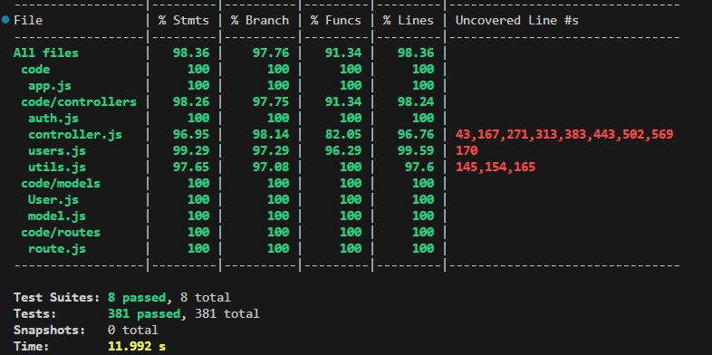

# Test Report

# Contents

- [Dependency graph](#dependency-graph)

- [Integration approach](#integration-approach)

- [Tests](#tests)

- [Coverage](#Coverage)

# Dependency graph 

     
# Integration approach

   
 
The integration sequence that was adopted follows a bottom-up approach starting from unit testing ending with API testing.  
The development process started by creating the individual functions. These functions were then isolately tested using unit tests. Mocks objects were used to simulate dependencies ensuring that each mocked functions behaved correctly. 
We then integrated functions and modules ensuring that the interaction between the functions and their dependencies worked as expected.  
API testing was conducted handling routes incoming requests and confirming the expected response. Summarizing here the step followed: 
 
1. step: unit testing 
     - step 1.1: util.js 
    - step 1.2: users.js 
     - step 1.3: controller.js 
    - step 1.4: auth.js 
2.  step: API testing 
    - step 2.1: util.integration.test.js 
    - step 2.2: users.integration.test.js 
    - step 2.3: controller.integration.test.js 
    - step 2.4: auth.integration.test.js 
 
 
Although integration testing was omitted, our team effectively executed API testing and unit testing, ensuring comprehensive coverage of all dependency scenarios. Considered the complexity f the project as well as the above described considerations they minimized a chaotic "big bang" integration and facilitated the identification of errors during function development. By accurately testing each function with various inputs, including those expected to produce errors (e.g., invalid email formats), and employing mocking functions to handle different conditions, we successfully addressed potential issues. However, it is essential to acknowledge that the current organizational situation exacerbated the challenges faced, noticeably the lack of integration testing complicated the system's overall complexity and risk. Despite this setback, our rigorous API and unit testing approach significantly reduced the likelihood of critical errors and allowed for targeted issue resolution within individual components. 

# Tests

| Test case name | Object(s) tested | Test level | Technique used |
|--|--|--|--|
| FR1 Manage users |||| 
| FR11 register||||
| Nominal scenario|register|unit|WB/ statement coverage|
|Exception existing email|register|unit|WB/ statement coverage|
|Exception existing username|register|unit|WB/ statement coverage|
|Exception Missing params: empty email|register|unit|WB/ statement coverage|
|Exception wrong email format|register|unit|WB/ statement coverage|
|Exception thrown error catch|register|unit|BB/ boundary|
| FR12 login||||
|Nominal scenario|login|unit|WB/ statement coverage|
|Wrong credentials scenario|login|unit|WB/ statement coverage|
|Empty email |login|unit|WB/ statement coverage|
|User not found |login|unit|WB/ statement coverage|
|Wrong format email |login|unit|WB/ statement coverage|
|Throw catch error |login|unit|BB/ boundary|
| FR13 logout||||
|Nominal scenario|logout|unit|WB/ statement coverage|
|User not found scenario|logout|unit|WB/ statement coverage|
|Not authenticated scenario|logout|unit|WB/ statement coverage|
|No Refresh Token scenario|logout|unit|WB/ statement coverage|
|Try catch scenario |logout|unit|BB/ boundary|
| FR14 registerAdmin||||
|Nominal scenario	|registerAdmin|	unit|	WB/ statement coverage|
|Exception: Existing email	|registerAdmin	|unit	|WB/statement coverage|
|Exception: Existing username	|registerAdmin|	unit	|WB/statement coverage|
|Exception: Empty email	|registerAdmin	|unit	|WB/statement coverage|
|Exception: Missing attribute email|	registerAdmin	|unit|	WB/statement coverage|
|Exception: Incorrect email format	|registerAdmin|	unit|	WB/statement coverage|
|Exception thrown and caught	|registerAdmin|	unit|	BB/boundary|
| FR15 getUsers ||||
| Nominal scenario | getUsers | unit | WB/ statement coverage |
| Should return an empty list if no users in the db | getUsers | unit | WB/statement coverage |
| Should return an error of authentication | getUsers | unit | WB/statement coverage |
| Exception thrown error catch | getUsers | unit | BB/boundary |
| FR16 getUser ||||
| Nominal scenario | getUser | unit | WB/ statement coverage |
| Should return an error when the user doesn't exist | getUser | unit | WB/statement coverage |
| Should return an error of authentication | getUser | unit | WB/statement coverage |
| Exception thrown error catch | getUser | unit | BB/boundary |
| FR17 deleteUser ||||
| Nominal scenario | deleteUser | unit | WB/ statement coverage |
| Authentication fail scenario | deleteUser | unit | WB/statement coverage |
| Missing email fail scenario | deleteUser | unit | WB/statement coverage |
| Wrong email format fail scenario | deleteUser | unit | WB/statement coverage |
| Missing user fail scenario | deleteUser | unit | WB/statement coverage |
| One found scenario | deleteUser | unit | WB/statement coverage |
| Thrown scenario | deleteUser | unit | BB/boundary |
| FR2 Manage groups ||||
| FR21 createGroup ||||
| Nominal scenario | createGroup | unit | WB/ statement coverage |
| Should return an error if the body is incomplete | createGroup | unit | WB/statement coverage |
| Should return an error if the name in the body is an empty string | createGroup | unit | WB/statement coverage |
| Should return an error when there's already a group with the same name | createGroup | unit | WB/statement coverage |
| Should return an error if all members are already in a group or don't exist | createGroup | unit | WB/statement coverage |
| Should return an error if the user who calls the API is already in a group | createGroup | unit | WB/statement coverage |
| Should return an error if an email is invalid | createGroup | unit | WB/statement coverage |
| Should return an error if an email is an empty string | createGroup | unit | WB/statement coverage |
| Should return an error Missing values | createGroup | unit | WB/statement coverage |
| Should return an error of authentication | createGroup | unit | WB/statement coverage |
| Exception thrown error catch | createGroup | unit | BB/boundary |
| Should return an enter if(!foundInGroup) | createGroup | unit | WB/statement coverage|
| FR22 getGroups ||||
| Nominal scenario | getGroups | unit | WB/ statement coverage |
| Should return an error of authentication | getGroups | unit | WB/statement coverage |
| Exception thrown error catch | getGroups | unit | BB/boundary |
| FR23 getGroup ||||
| Nominal scenario | getGroup | unit | WB/ statement coverage |
| Should return an error if missing or empty parameters | getGroup | unit | WB/statement coverage |
| Should return an error if the group doesn't exist | getGroup | unit | WB/statement coverage |
| Should return an error of authentication | getGroup | unit | WB/statement coverage |
| Exception thrown error catch | getGroup | unit | BB/boundary |
| FR24 addToGroup ||||
| Nominal scenario | addToGroup | unit | WB/ statement coverage |
| Should return an error if the body doesn't contain all attributes | addToGroup | unit | WB/statement coverage |
| Should return an error if the group doesn't exist | addToGroup | unit | WB/statement coverage |
| Should return an error if all the emails are already in the group or not existing | addToGroup | unit | WB/statement coverage |
| Should return an error if at least one email is invalid (format) | addToGroup | unit | WB/statement coverage |
| Should return an error if at least one email is an empty string | addToGroup | unit | WB/statement coverage |
| Should return an error of authentication (admin) | addToGroup | unit | WB/statement coverage |
| FR26 removeFromGroup ||||
| Nominal scenario | removeFromGroup | unit | WB/ statement coverage |
| The group doesn't exist | removeFromGroup | unit | WB/statement coverage |
| Missing params | removeFromGroup | unit | WB/statement coverage |
| Member emails not defined | removeFromGroup | unit | WB/statement coverage |
| Empty email | removeFromGroup | unit | WB/statement coverage |
| Regex failed email | removeFromGroup | unit | WB/statement coverage |
| Admin failed login | removeFromGroup | unit | WB/statement coverage |
| Group failed login | removeFromGroup | unit | WB/statement coverage |
| Length 0 toDelete | removeFromGroup | unit | WB/statement coverage |
| If the group has the same number of members to delete, 200 but leave just one | removeFromGroup | unit | WB/statement coverage |
| If the group has 1 member and is the selected | removeFromGroup | unit | WB/statement coverage |
| Throw error | removeFromGroup | unit | BB/boundary |
| FR28 deleteGroup ||||
| Nominal scenario | deleteGroup | unit | WB/ statement coverage |
| Missing params scenario | deleteGroup | unit | WB/statement coverage |
| The group doesn't exist scenario | deleteGroup | unit | WB/statement coverage |
| Admin not authenticated | deleteGroup | unit | WB/statement coverage |
| Throw exception | deleteGroup | unit | BB/boundary |
| FR3 Manage transactions ||||
| FR31 createTransaction ||||
| Nominal scenario | createTransaction | unit | WB/ statement coverage |
| Should return an error when empty or missing parameters | createTransaction | unit | WB/statement coverage |
| Should return an error if the amount can't be parsed as a float | createTransaction | unit | WB/statement coverage |
| Should return an error if the requesting user doesn't exist | createTransaction | unit | WB/statement coverage |
| Should return an error if the requesting user is not in the group | createTransaction | unit | WB/statement coverage |
| Should return an error of authentication | createTransaction | unit | WB/statement coverage |
| Exception thrown error catch | createTransaction | unit | BB/boundary |
|FR32 getAllTransactions| 
| Nominal scenario |getAllTransactions|unit|WB/ statement coverage|
|should return empty array when there are no transactions|getAllTransactions|unit | WB/statement coverage |
|should return an error of authentication|getAllTransactions|unit | WB/statement coverage |
|Exception thrown error catch|getAllTransactions | unit | BB/boundary |
| FR33 getTransactionsByUser ||||
| Nominal scenario | getTransactionsByUser |  unit | WB/ statement coverage |
| Should return an error if the user doesn't exist | getTransactionsByUser | unit | WB/statement coverage |
| Should return an error of authentication (admin) | getTransactionsByUser | unit | WB/statement coverage |
| Should return an error of authentication (user) | getTransactionsByUser | unit | WB/statement coverage |
| Exception thrown error catch | getTransactionsByUser | unit | BB/boundary |
| FR34 getTransactionsByUserByCategory ||||
| Nominal scenario | getTransactionsByUserByCategory | unit | WB/ statement coverage |
| Should return an error if the user doesn't exist | getTransactionsByUserByCategory | unit | WB/statement coverage |
| Should return an error if the category doesn't exist | getTransactionsByUserByCategory | unit | WB/statement coverage |
| Should return an error of authentication (admin) | getTransactionsByUserByCategory | unit | WB/statement coverage |
| Should return an error of authentication (user) | getTransactionsByUserByCategory | unit | WB/statement coverage |
| Exception thrown error catch | getTransactionsByUserByCategory | unit | BB/boundary |
| FR35 getTransactionsByGroup ||||
| Nominal scenario | getTransactionsByGroup | unit | WB/ statement coverage |
| Should return an error if the group doesn't exist | getTransactionsByGroup | unit | WB/statement coverage |
| Should return an error of authentication (admin) | getTransactionsByGroup | unit | WB/statement coverage |
| Should return an error of authentication (group) | getTransactionsByGroup | unit | WB/statement coverage |
| Exception thrown error catch | getTransactionsByGroup | unit | BB/boundary |
| FR36 getTransactionsByGroupByCategory ||||
| Nominal scenario | getTransactionsByGroupByCategory | unit | WB/ statement coverage |
| Should return an error if the group doesn't exist | getTransactionsByGroupByCategory | unit | WB/statement coverage |
| Should return all transactions of a group of a category | getTransactionsByGroupByCategory | unit | WB/statement coverage |
| Should return an error of authentication (admin) | getTransactionsByGroupByCategory | unit | WB/statement coverage |
| Should return an error of authentication (group) | getTransactionsByGroupByCategory | unit | WB/statement coverage |
| Exception thrown error catch | getTransactionsByGroupByCategory | unit | BB/boundary |
| FR37 deleteTransaction ||||
|Nominal scenario| deleteTransaction | unit | WB/ statement coverage |
| Should return an error if the transaction to be deleted doesn't exist | deleteTransaction | unit | WB/statement coverage |
| Should return an error of authentication (admin) | deleteTransaction | unit | WB/statement coverage |
| Should return an error of authentication (other user) | deleteTransaction | unit | WB/statement coverage |
| Exception thrown error catch | deleteTransaction | unit | BB/boundary |
| FR38 deleteTransactions ||||
| Nominal scenario | deleteTransactions | unit | WB/ statement coverage |
| should return an error if missing or empty body | deleteTransactions | unit | WB/statement coverage |
| should return an error if at least one transaction is not in the database | deleteTransactions | unit | WB/statement coverage |
| should return an error of authentication | deleteTransactions | unit | WB/statement coverage |
| Exception thrown error catch | deleteTransactions | unit | BB/boundary |
| FR4 Manage categories ||||
| FR41 createCategory ||||
| Nominal scenario | createCategory | unit | WB/ statement coverage |
| Should return an error if missing or empty parameters | createCategory | unit | WB/statement coverage |
| Should return an error if the category already exists | createCategory | unit | WB/statement coverage |
| Should return an error of authentication | createCategory | unit | WB/statement coverage |
| Exception thrown error catch | createCategory | unit | BB/boundary |
| FR42 getCategories ||||
| Nominal scenario | getCategories | unit | WB/ statement coverage |
| Should return an error of authentication | getCategories | unit | WB/statement coverage |
| Exception thrown error catch | getCategories | unit | BB/boundary |
| FR43 updateCategory ||||
| Nominal scenario| updateCategory | unit | WB/ statement coverage |
| Should return an error if the category to be updated doesn't exist | updateCategory | unit | WB/statement coverage |
| Should return an error of authentication | updateCategory | unit | WB/statement coverage |
| Exception thrown error catch | updateCategory | unit | BB/boundary |
| FR44 deleteCategory ||||
| Nominal scenario | deleteCategory | unit | WB/ statement coverage |
| Should return an error if the category to be deleted doesn't exist | deleteCategory | unit | WB/statement coverage |
| Should return an error of authentication | deleteCategory | unit | WB/statement coverage |
| Exception thrown error catch | deleteCategory | unit | BB/boundary |

| Test case name | Object(s) tested | Test level | Technique used |
|--|--|--|--|
| FR1 Manage users |||| 
| FR11 register||||
| Nominal scenario|register|integration|WB/ statement coverage|
|Exception existing email|register|integration|WB/ statement coverage|
|Exception existing username|register|integration|WB/ statement coverage|
|Exception no username|register|integration|WB/ statement coverage|
|Exception wrong email format|register|integration|WB/ statement coverage|
| FR12 login||||
|Nominal scenario|login|integration|WB/ statement coverage|
|Exception not existing user|login|integration|WB/ statement coverage|
|Exception wrong credential|login|integration|WB/ statement coverage|
|Exception empty email|login|integration|WB/ statement coverage|
|Exception wrong email format|login|integration|WB/ statement coverage|
| FR13 logout||||
|Nominal scenario|logout|integration|WB/ statement coverage|
|User not found scenario|logout|integration|WB/ statement coverage|
|Not authenticated scenario|logout|integration|WB/ statement coverage|
| FR14 registerAdmin||||
|Nominal scenario	|registerAdmin|	integration|	WB/ statement coverage|
|Exception empty username|registerAdmin	|integration	|WB/statement coverage|
|Exception wrong email format|registerAdmin|	integration	|WB/statement coverage|
|Exception Existing username|registerAdmin	|integration	|WB/statement coverage|
|Exception Existing email|	registerAdmin	|integration|	WB/statement coverage|
| FR15 getUsers ||||
| Nominal scenario | getUsers | integration | WB/ statement coverage |
| Exception authentication (user token) | getUsers | integration | WB/statement coverage |
| FR16 getUser ||||
| Nominal scenario | getUser | integration | WB/ statement coverage |
| Should return an error when the user doesn't exist | getUser | integration | WB/statement coverage |
| should return an error of authentication (wrong user token) | getUser | integration | WB/statement coverage |
| FR17 deleteUser ||||
| Nominal scenario | deleteUser | integration | WB/ statement coverage |
| user in a group alone | deleteUser | integration | WB/statement coverage |
| missing params admin | deleteUser | integration | WB/statement coverage |
| not admin | deleteUser | integration | WB/statement coverage |
| email wrong format | deleteUser | integration | WB/statement coverage |
| email doens't exists | deleteUser | integration | WB/statement coverage |
| FR2 Manage groups ||||
| FR21 createGroup ||||
| Nominal scenario | createGroup | integration | WB/ statement coverage |
| Should return an error if the body is incomplete | createGroup | integration | WB/statement coverage |
| Should return an error if the name in the body is an empty string | createGroup | integration | WB/statement coverage |
| Should return an error when there's already a group with the same name | createGroup | integration | WB/statement coverage |
| Should return an error if all members are already in a group or don't exist | createGroup | integration | WB/statement coverage |
| Should return an error if the user who calls the API is already in a group | createGroup | integration | WB/statement coverage |
| Should return an error if an email is invalid | createGroup | integration | WB/statement coverage |
| Should return an error if an email is an empty string | createGroup | integration | WB/statement coverage |
| should return an error of authentication (missing token) | createGroup | integration | WB/statement coverage |
| FR22 getGroups ||||
| Nominal scneario | getGroups | integration | WB/ statement coverage |
| should return an error of authentification (user token) | getGroups | integration | WB/statement coverage |
| FR23 getGroup ||||
| Nominal scenario | getGroup | integration | WB/ statement coverage |
| Should return an error if the group doesn't exist | getGroup | integration | WB/statement coverage |
| should return an error of authentification (user is not in the group) | getGroup | integration | WB/statement coverage |
| FR24 addToGroup ||||
| Nominal scenario | addToGroup | integration | WB/ statement coverage |
| Should return an error if the body doesn't contain all attributes | addToGroup | integration | WB/statement coverage |
| Should return an error if the group doesn't exist | addToGroup | integration | WB/statement coverage |
| Should return an error if all the emails are already in the group or not existing | addToGroup | integration | WB/statement coverage |
| Should return an error if at least one email is invalid (format) | addToGroup | integration | WB/statement coverage |
| Should return an error if at least one email is an empty string | addToGroup | integration | WB/statement coverage |
| should return an error of authentication (user is not in the group) | addToGroup | integration | WB/statement coverage |
| should return an error of authentication (user using wrong path) | addToGroup | integration | WB/statement coverage |
| FR26 removeFromGroup ||||
| Nominal scenario | removeFromGroup | integration | WB/ statement coverage |
| The group doesn't exist | removeFromGroup | integration | WB/statement coverage |
| member emails not defined | removeFromGroup | integration | WB/statement coverage |
| Empty email | removeFromGroup | integration | WB/statement coverage |
| Regex failed email | removeFromGroup | integration | WB/statement coverage |
| all the members don't exits or are not in the group | removeFromGroup | integration | WB/statement coverage |
| should return an error of authentication (user try admin route) | removeFromGroup | integration | WB/statement coverage |
| should return an error of authentication (user not in Group) | removeFromGroup | integration | WB/statement coverage |
| FR28 deleteGroup ||||
| Nominal scenario | deleteGroup | integration | WB/ statement coverage |
| Missing params | deleteGroup | integration | WB/statement coverage |
| The group doesn't exist | deleteGroup | integration | WB/statement coverage |
| not admin authenticated | deleteGroup | integration | WB/statement coverage |
| FR3 Manage transactions ||||
| FR31 createTransaction ||||
| Nominal scenario | createTransaction | integration | WB/ statement coverage |
| Should return an error when empty parameters | createTransaction | integration | WB/statement coverage |
| Should return an error when missing parameters | createTransaction | integration | WB/statement coverage |
| Should return an error if the amount can't be parsed as a float | createTransaction | integration | WB/statement coverage |
| Should return an error if the requesting user doesn't exist | createTransaction | integration | WB/statement coverage |
| Should return an error if requesting user doesn't match involved user | createTransaction | integration | WB/statement coverage |
| Should return an error if category doesn't exist | createTransaction | integration | WB/statement coverage |
| Should return an error of authentication (wrong user token)| createTransaction | integration | WB/statement coverage |
| Should return an error of authentication (missing token) | createTransaction | integration | BB/boundary |
|FR32 getAllTransactions| 
| Nominal scenario |getAllTransactions|integration|WB/ statement coverage|
| Should return an error of authentication (user token)|getAllTransactions |integration | WB/statement coverage |
| Should return an error of authentication (missing token) |getAllTransactions | integration | BB/boundary |
| FR33 getTransactionsByUser ||||
| Nominal scenario | getTransactionsByUser |  integration | WB/ statement coverage |
| Should return an error if the user doesn't exist | getTransactionsByUser | integration | WB/statement coverage |
| Should return all transactions by a specific user filtered date and amount| getTransactionsByUser | integration | WB/statement coverage |
| Should return an error of authentication (user token instead of admin) | getTransactionsByUser | integration | WB/statement coverage |
| Should return an error of authentication (admin token instead of user) | getTransactionsByUser | integration | WB/statement coverage |
| Should return an error of authentication (missing token) | getTransactionsByUser | integration | BB/boundary |
| FR34 getTransactionsByUserByCategory ||||
| Nominal scenario              | getTransactionByUserByCategory | integration | WB/ statement coverage |
| Should return an error if user doesn't exist                     | getTransactionByUserByCategory | integration | WB/statement coverage |
| Should return an error if category doesn't exist                 | getTransactionByUserByCategory | integration | WB/statement coverage |
| Should return an error of authentication (user token instead of admin) | getTransactionByUserByCategory | integration | WB/statement coverage |
| Should return an error of authentication (admin token instead of user) | getTransactionByUserByCategory | integration | WB/statement coverage |
| Should return an error of authentication (missing token)         | getTransactionByUserByCategory | integration | BB/boundary           |integration | BB/boundary |
| FR35 getTransactionsByGroup ||||
| Nominal scenario          | getTransactionByGroup      | integration | WB/ statement coverage |
| Should return an error if the group doesn't exist           | getTransactionByGroup      | integration | WB/statement coverage |
| Should return an error of authentication (user not part of the group) | getTransactionByGroup      | integration | WB/statement coverage |
| Should return an error of authentication (not admin)        | getTransactionByGroup      | integration | WB/statement coverage |
| Should return an error of authentication (token missing)    | getTransactionByGroup      | integration | BB/boundary           |
| FR36 getTransactionsByGroupByCategory ||||
|Nominal scenario  | getTransactionsByGroupByCategory      | integration | WB/ statement coverage |
| Should return an error if the group doesn't exist                       | getTransactionsByGroupByCategory      | integration | WB/statement coverage |
| Should return an error of authentication (user not part of the group)  | getTransactionsByGroupByCategory      | integration | WB/statement coverage |
| Should return an error of authentication (not admin)                    | getTransactionsByGroupByCategory      | integration | WB/statement coverage |
| Should return an error of authentication (token missing)                | getTransactionsByGroupByCategory      | integration | BB/boundary           |
| FR37 deleteTransaction ||||
|Nominal scenario            | deleteTransaction | integration | WB/ statement coverage |
| Should return an error if missing parameters in body                     | deleteTransaction | integration | WB/statement coverage |
| Should return an error if empty strings in body                           | deleteTransaction | integration | WB/statement coverage |
| Should return an error if user doesn't exist                             | deleteTransaction | integration | WB/statement coverage |
| Should return an error if transaction isn't made by requesting user      | deleteTransaction | integration | WB/statement coverage |
| Should return an error of authentication (missing token)                 | deleteTransaction | integration | BB/boundary           |
| FR38 deleteTransactions ||||
| Nominal scenario     | deleteTransactions | integration | WB/statement coverage |
| Should return an error if missing parameters in body            | deleteTransactions | integration | WB/statement coverage |
| Should return an error if empty strings in body                  | deleteTransactions | integration | WB/statement coverage |
| Should return an error if at least one transaction is not in the database | deleteTransactions | integration | WB/statement coverage |
| Should return an error of authentication (user token)           | deleteTransactions | integration | BB/boundary           |
| Should return an error of authentication (missing token)        | deleteTransactions | integration | BB/boundary           |
| FR4 Manage categories ||||
| FR41 createCategory ||||
| Nominal scenario       | createCategory | integration | WB/statement coverage |
| Should return an error if missing field in body | createCategory | integration | WB/statement coverage |
| Should return an error if a field is an empty string | createCategory | integration | WB/statement coverage |
| Should return an error if category already exists | createCategory | integration | WB/statement coverage |
| Should return an error if the tokens are not present | createCategory | integration | BB/boundary           |
| Should return an error of authentication (user token) | createCategory | integration | BB/boundary           |
| FR42 getCategories ||||
| Nominal scenario| getCategories | integration | WB/ statement coverage |
| Should return an error of authentication (missing token)| getCategories | integration | WB/statement coverage |
| FR43 updateCategory ||||
| Nominal scenario| updateCategory | integration | WB/statement coverage |
| Should return an error if missing parameters               | updateCategory | integration | WB/statement coverage |
| Should return an error if empty strings parameters         | updateCategory | integration | WB/statement coverage |
| Should return an error if category in route parameters doesn't exist | updateCategory | integration | WB/statement coverage |
| Should return an error if category in body already exists  | updateCategory | integration | WB/statement coverage |
| Should return an error of authentication (user token)      | updateCategory | integration | BB/boundary           |
| Should return an error of authentication (missing token)   | updateCategory | integration | BB/boundary           |
| FR44 deleteCategory ||||
| Nominal scenario                                                 | deleteCategory  | integration | WB/statement coverage |
| Should return an error if missing field in body                                       | deleteCategory  | integration | WB/statement coverage |
| Should return an error if there's an empty string                                     | deleteCategory  | integration | WB/statement coverage |
| Should return an error if there's a category to be deleted that is not in the database | deleteCategory  | integration | WB/statement coverage |
| Should return an error if there's only one category in the database                   | deleteCategory  | integration | WB/statement coverage |
| Should return an error of authentication (user token)                                 | deleteCategory  | integration | BB/boundary           |
| Should return an error of authentication (missing token)                              | deleteCategory  | integration | BB/boundary           |

# Coverage

## Coverage of FR

| Functional Requirements covered |   Unit Test(s) |  
| ------------------------------- | ----------- |  
|  FR1 Manage users   |  | 
| FR11 register|<ul><li>Nominal scenario</li><li>Exception existing email</li><li>Exception existing username</li><li>Exception Missing params: empty email</li><li>Exception wrong email format</li><li>Exception thrown error catch</li> </ul> | 
| FR12 login| <ul><li>Nominal scenario</li> <li>Wrong credentials scenario</li> <li>Empty email</li> <li>User not found</li> <li>Wrong format email</li> <li>Throw catch error</li></ul>| 
| FR13 logout|<ul><li>Nominal scenario</li> <li>User not found scenario</li>  <li>Not authenticated scenario</li>  <li>No Refresh Token scenario</li>  <li>Try catch scenario</li></ul>|  
| FR14 registerAdmin |<ul> <li>Nominal scenario</li>  <li>Exception existing email</li>  <li>Exception existing username</li>  <li>Exception empty email</li>  <li>Exception attribute email missing</li><li>Exception attribute email wrong format</li> <li>Exception thrown catch</li></ul>| 
| FR15 getUsers | <ul><li>Nominal scenario</li><li>should an empty list if no users in the db</li><li>should return an error of authentication</li><li>Exception thrown error catch</li></ul>|  
| FR16 getUser| <ul><li>Nominal scenario</li><li>should return an error when the user doesnt exist</li><li>should return an error of authentication</li><li>Exception thrown error catch</li></ul>|  
| FR17 deleteUser |<ul><li>Nominal scenario</li><li>authentification fail scenario</li><li>mssing email fail scenario</li><li>wrong email format fail scenario</li><li>mssing user fail scenario</li><li>one found scenario</li><li>thrown scenario</li></ul>|  
| FR2 Manage groups | | 
| FR21 createGroup |<ul><li>Nominal scenario</li><li>should return an error if the body is incomplete</li><li>should return an error if the name in the body is an empty string</li><li>should return an error when theres already a group with the same name</li><li>should return an error if all members are already in a group or dont exist</li><li>should return an error if the user who calls the API is already in a group</li><li>should return an error if an email is invalid</li><li>should return an error if an email is an empty string</li><li>should return an error Missing values</li><li>should return an error of authentication</li><li>Exception thrown error catch</li><li>should return an enter if(!foundInGroup)</li></ul>  | 
| FR22 getGroups| <ul><li>should retrieve list of all groups</li><li>should return an error of authentication</li><li>Exception thrown error catch</li></ul>| 
| FR23 getGroup |<ul><li>Nominal scenario</li><li>should return an error if missing or empty parameters</li><li>should return an error if the group doesnt exist</li><li>should return an error of authentication</li><li>Exception thrown error catch</li></ul>| 
| FR24 addToGroup| <ul><li>Nominal scenario</li><li>Should return an error if the body doesnt contain all attributes</li><li>Should return an error if the group doesnt exist</li><li>Should return an error if all the emails are already in group or not existing</li><li>Should return an error if at least one email is invalid (format)</li><li>Should return an error if at least one email is an empty string</li><li>Should return an error of authentication (admin)</li></ul>|  
| FR26 removeFromGroup| <ul><li>Nominal scenario</li><li>The group doesnt exist</li><li>missing params</li><li>member emails not defined</li><li>Empty email</li><li>Regex failed email</li><li>Admin failed login</li><li>Group failed login</li><li>length 0 toDelete</li><li>if the group has same number members to delete, 200 but leave just one</li><li>if the group has 1 member and is the selected</li><li>throw error</li></ul>| 
| FR28 deleteGroup|<ul><li>Nominal scenario</li><li>Missin params scenario</li><li>The group doesnt exist scenario</li><li>admin not authentificated</li><li>throw expection</li></ul> | 
|  FR3   Manage  transactions|  |  
|FR31 createTransaction|<ul><li>should create a new transaction successfully</li><li>should return an error when empty or missing parameters</li><li>should return an error if amount can\t be parsed as float</li><li>should return an error if requesting user doesn\t match involved user</li><li>should return an error if involved user doesn\t exist</li><li>should return an error if category doesn\t exist</li><li>should return an error if requesting user doesn\t exist</li><li>should return an error of authentication</li><li>Exception thrown error catch</li></ul>|  
|FR32 getAllTransactions| <ul><li>should return all transactions by all users</li><li>should return empty array when there are no transactions</li><li>should return an error of authentication</li><li>Exception thrown error catch</li></ul>|  
| FR33 getTransactionsByUser| <ul><li>should return all transactions of a user </li><li>should return all transactions of a user </li><li>should return an error if user doesnt exist</li><li>should return an error of authentication (admin)</li><li>should return an error of authentication (user)</li><li>Exception thrown error catch</li></ul>| 
| FR34 getTransactionsByUserByCategory| <ul><li>should return all transactions of a user of a specific category</li><li>should return an error if the user doesnt exist</li><li>should return an error if the category doesnt exist</li><li>should return an error of authentication (admin)</li><li>should return an error of authentication (user)</li><li>Exception thrown error catch</li></ul>| 
| FR35 getTransactionsByGroup|<ul><li>should return all transactions of a group</li><li>should return an error if the group doesnt exist</li><li>should return an error of authentication (admin)</li><li>should return an error of authentication (group)</li><li>Exception thrown error catch</li></ul>  |  
| FR36 getTransactionsByGroupByCategory| <ul><li>should return all transactions of a group of a category</li><li>should return an error if the group doesnt exist</li><li>should return all transactions of a group of a category</li><li>should return an error of authentication (admin)</li><li>should return an error of authentication (group)</li><li>Exception thrown error catch</li></ul> | 
| FR37 deleteTransaction| <ul><li>should successfully delete a transaction of a specific user</li><li>should return an error if the transaction to be deleted doesnt exist</li><li>should return an error of authentication (admin)</li><li>should return an error of authentication (other user)</li><li>Exception thrown error catch</li></ul>  |  
| FR38 deleteTransactions  |<ul><li>Test 1: should successfully delete multiple transactions</li><li>Test 2: should return an error if missing or empty body</li><li>Test 3: should return an error if at least one transaction is not in the database</li><li>Test 4: should return an error of authentication</li><li>Test 5: Exception thrown error catch</li></ul>|
|  FR4  Manage categories|   | 
| FR41 createCategory |<ul><li>Nominal scenario</li><li>should return an error if missing or empty parameters</li><li>should return an error if category already exists</li><li>should return an error of authentication</li><li>Exception thrown error catch</li></ul>  |  
| FR42 updateCategory| <ul><li>Nominal scenario</li><li>should return an error if missing or empty parameters</li><li>should return an error if category in route parameters doesn\t exist</li><li>should return an error if category in body already exists</li><li>should return an error of authentication</li><li>Exception thrown error catch</li></ul>|  
| FR43 deleteCategory| <ul><li>Nominal scenario</li><li>should return an error if missing field in body</li><li>should return an error if theres an empty string</li><li>should return an error if theres a category to be deleted that is not in the database</li><li>should return an error if theres only one category in the database</li><li>should return an error of authentication</li><li>Exception thrown error catch</li></ul>| 
| FR44 getCategories | <ul><li>Nominal scenario</li><li>should return an error of authentication</li><li>Exception thrown error catch</li></ul>|  

## Coverage white box

     

